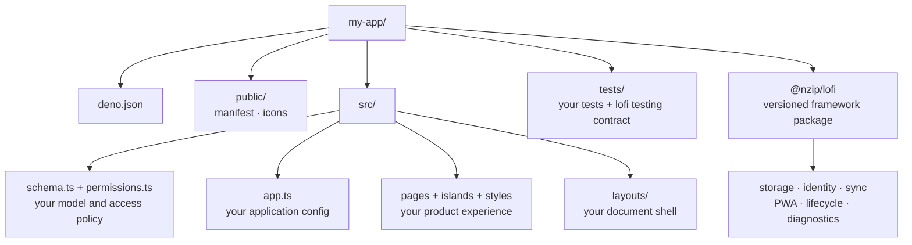

# @nzip/lofi

**Build installable Deno web apps that open immediately, keep working offline, and sync when users
choose.**

lofi generates an [Astro](https://astro.build) + [Preact](https://preactjs.com) app backed by
durable local data. Users start with a private, on-device account—no sign-in or network required—and
can add [Jazz](https://jazz.tools)-powered sync and recovery later without replacing that identity
or rewriting product code.

[Documentation](docs/README.md) · [JSR package](https://jsr.io/@nzip/lofi) ·
[GitHub](https://github.com/FelineStateMachine/lofi) · [MIT License](LICENSE)

## Quick start

Requires **Deno 2.9+**. It is the only global runtime you need.

```sh
deno run -A jsr:@nzip/lofi/create my-app
cd my-app
deno task dev
```

Open the URL printed by the development server. The starter is a small task app: add a task and
reload the page to see that it remains in durable local storage. Once the page is open, disconnect
the network and you can keep reading and writing data locally.

The generated app starts in local-only mode. You do not need an account, a backend, or an `.env`
file to begin building.

Continue with the [generated-app guide](docs/getting-started.md) when you are ready to replace the
task example with your own schema, permissions, hook, and UI.

## What you get

- **Local-first data.** The UI reads from durable local storage instead of waiting on the network.
  Storage failures are surfaced rather than silently falling back to memory.
- **Identity from the first launch.** Each user begins with a private on-device account, even when
  the app has no sync service configured.
- **Optional sync and recovery.** Users can make that same account portable when you connect the app
  to managed Jazz sync.
- **A narrow authoring surface.** Product code owns the schema, permissions, configuration, Preact
  islands, styles, and tests. lofi owns storage, identity, sync, lifecycle, and PWA plumbing.
- **Local-first test helpers.** Playwright-backed fixtures cover offline writes, multiple clients,
  convergence, and readiness without hand-timed sleeps.
- **Explicit mobile support.** Unsupported browsers receive a clear explanation instead of a
  partially working app that risks data loss.

## Add sync and account recovery

To provision sync while scaffolding:

```sh
deno run -A jsr:@nzip/lofi/create --sync my-app
```

For an existing generated project:

```sh
deno task jazz:provision
```

Provisioning creates a managed Jazz app and writes the public `JAZZ_APP_ID` and `JAZZ_SERVER_URL`
configuration to the project's `.env`. Server-only credentials remain outside client output.

Once sync is configured, a user can choose to back up and sync their existing account, then recover
it on another device with a 24-word recovery phrase. Enabling sync preserves data created while the
app was local-only because the account identity does not change.

## Where lofi fits

lofi is designed for mobile web apps where offline operation is a requirement, not a best-effort
enhancement. It is a good fit when you want Deno tooling, an Astro shell, Preact islands, and an
opinionated boundary between product code and local-first infrastructure.

Keep these current constraints in mind:

- lofi is an early, pre-1.0 release.
- The data layer is Jazz 2 alpha and deliberately pinned to a reviewed version.
- The supported browser floors are Android Chrome 148+ and iOS Safari 16.4+.
- Recovery is user-controlled: lofi does not retain recoverable account material on the server, so
  the recovery phrase must be kept safe.

## Project anatomy

A generated project keeps application source separate from the versioned framework package:



Product work stays in `schema.ts`, `permissions.ts`, `app.ts`, `pages/`, `layouts/`, `islands/`, and
`styles/`. Framework behavior is imported from `@nzip/lofi`; upgrading the package updates runtime
code without copying it into your source tree.

## Testing local-first behavior

`@nzip/lofi/testing` provides Playwright-backed helpers for behavior that is difficult to test with
ordinary unit tests: two-client fixtures, concurrent offline writes, convergence, readiness waits,
and secret-free failure artifacts.

Every generated project includes a worked example at `tests/convergence_e2e_test.ts`.

## Commands

Every generated project exposes these tasks as `deno task <name>`.

### Everyday development

| Command   | What it does                                                      |
| --------- | ----------------------------------------------------------------- |
| `dev`     | Runs the Astro development server and prints runtime state.       |
| `doctor`  | Checks readiness without printing configuration or secret values. |
| `test`    | Runs the deterministic local-first test suite.                    |
| `build`   | Creates a static production build in `dist/`.                     |
| `preview` | Serves the production build locally.                              |

### Sync, schema, and deployment

| Command                                 | What it does                                      |
| --------------------------------------- | ------------------------------------------------- |
| `jazz:provision`                        | Creates a managed Jazz app and configures `.env`. |
| `schema:validate` / `schema:deploy`     | Validates and publishes the Jazz schema.          |
| `migrations:create` / `migrations:push` | Authors and pushes schema migrations.             |
| `deploy` / `deploy:create`              | Hosts the static build on Deno Deploy.            |

## Stack and version policy

| Layer      | Choice                                     | Pinned at           |
| ---------- | ------------------------------------------ | ------------------- |
| Data/sync  | Jazz 2, CRDTs, OPFS                        | `2.0.0-alpha.53`    |
| UI runtime | Preact islands with a thin adapter         | Preact 10 / Astro 7 |
| Shell      | Fully prerendered Astro, statically hosted | Astro 7             |
| Toolchain  | Deno tasks and npm compatibility           | Deno 2.9            |

Version pins are deliberate. Because the data layer is an alpha, every upgrade is reviewed and
validated before it becomes part of the generated project.

## Identity and recovery model

A new app opens immediately on a private, on-device account. When managed sync is configured, the
user can back up and sync that same account and recover it elsewhere with the recovery phrase. The
phrase is the portable backup; keeping it safe is the user's responsibility.

See [Sync and recovery](docs/sync-and-recovery.md) for setup and shipping guidance, and
[Local-first accounts: open now, back up later](docs/auth-identity.md) for the detailed account
states, recovery guarantees, custody model, and optional passkey-based protection at rest.

## Developing lofi itself

This repository is the framework's development monorepo. `package/` contains the `@nzip/lofi`
source, while `apps/reference/` is the reference app against which the generator is validated.

See [CONTRIBUTING.md](https://github.com/FelineStateMachine/lofi/blob/main/CONTRIBUTING.md) for the
repository workflow and the
[DevX contract](https://github.com/FelineStateMachine/lofi/blob/main/docs/devx-contract.md) for the
framework's testable promises and boundaries.
