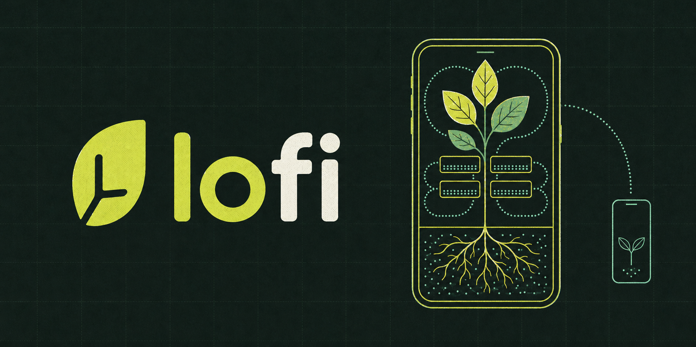

# @nzip/lofi

**Build installable Deno web apps that open immediately, keep working offline, and sync when users
choose.**

lofi generates an [Astro](https://astro.build) + [Preact](https://preactjs.com) app backed by
durable local data. Users start with a private, on-device account—no sign-in or network required—and
can add [Jazz](https://jazz.tools)-powered sync and recovery later without replacing that identity
or rewriting product code.

[Documentation](https://lofi.host/docs) · [API reference](https://lofi.host/api) ·
[Live demo](https://demo.lofi.host) · [JSR package](https://jsr.io/@nzip/lofi) ·
[MIT License](LICENSE)

Building with an AI agent? Feed it [llms.txt](https://lofi.host/llms.txt) for an index of the
documentation, or [llms-full.txt](https://lofi.host/llms-full.txt) for the complete docs and API
reference in one file — both generated from the deployed version's sources.

## Quick start

Requires **Deno 2.9+**. It is the only global runtime you need.

```sh
deno run -A jsr:@nzip/lofi/create my-app
cd my-app
deno task dev
```

Open the URL printed by the development server. The starter is a small task app: add a task and
reload the page to see that it remains in durable local storage. Once the page is open, disconnect
the network and you can keep reading and writing data locally. Prefer to look first? A reworked
build of the starter runs at [demo.lofi.host](https://demo.lofi.host), deployed by the release
workflow from the published package.

The generated app starts in local-only mode. You do not need an account, a backend, or an `.env`
file to begin building. To provision managed Jazz sync, scaffold with `--sync` or run
`deno task jazz:provision` later; either way users keep the account they already have.

Continue with [Getting started](https://lofi.host/docs/getting-started) when you are ready to
replace the task example with your own schema, permissions, hook, and UI.

## What you get

- **Local-first data** read from durable local storage; failures are surfaced, never silently
  swapped for memory.
- **Identity from the first launch**, with optional sync and account recovery via passkey or a
  24-word phrase.
- **Narrow collaboration templates** — private, direct-share, and fixed-role group access behind a
  small [`@nzip/lofi/access`](https://lofi.host/api/access) API.
- **Verbs with sync-boundary effects** — `s.mutation` declares named verbs whose writes return a
  `WriteHandle`; `onSynced`/`onRejected` consequences run on the originating device from a durable
  journal that survives reloads, with pending-write and per-row sync status hooks for the UI.
- **A schema compatibility gate** — each build stamps the schema range it understands, so a stale
  offline shell that meets newer data pauses editing (reads continue), shows the update path, and
  coordinates the worker swap across tabs.
- **Local-first test helpers** — Playwright-backed two-client fixtures for offline writes and
  convergence.
- **An explicit authoring boundary**: product code owns schema, permissions, config, islands,
  styles, and tests; lofi owns storage, identity, sync, lifecycle, and PWA plumbing.

The [documentation](https://lofi.host/docs) covers all of this in depth: guides,
[commands](https://lofi.host/docs/reference/commands),
[project layout](https://lofi.host/docs/reference/project-layout),
[installed-app recipes](https://lofi.host/docs/recipes),
[examples](https://lofi.host/docs/examples/shared), and the
[identity and recovery model](https://lofi.host/docs/auth-identity).

## Where lofi fits

lofi is designed for mobile web apps where offline operation is a requirement, not a best-effort
enhancement. Keep these current constraints in mind:

- lofi is an early, pre-1.0 release; do not yet trust it with data you cannot afford to lose.
- The data layer is Jazz 2 alpha and deliberately pinned to a reviewed version
  ([stack and version policy](https://lofi.host/#stack)). Five known engine defects at the current
  pin are each documented in a decision record and covered by an automated canary that fails loudly
  when a version bump changes the behavior.
- The sync server reads unencrypted columns. The [threat model](https://lofi.host/docs/threat-model)
  states what the server can and cannot see, what the user holds, and which fields the schema can
  seal.
- The supported browser floors are Android Chrome 148+ and iOS Safari 16.4+.
- Recovery is user-controlled: lofi does not retain recoverable account material on the server, so
  the recovery phrase must be kept safe.

## Developing lofi itself

This repository is the framework's development monorepo. `package/` contains the `@nzip/lofi`
source, `apps/reference/` is the reference app against which the generator is validated, and
`website/` builds the [lofi.host](https://lofi.host) documentation site.

See [CONTRIBUTING.md](https://github.com/FelineStateMachine/lofi/blob/main/CONTRIBUTING.md) for the
repository workflow and the
[DevX contract](https://github.com/FelineStateMachine/lofi/blob/main/docs/devx-contract.md) for the
framework's testable promises and boundaries.
