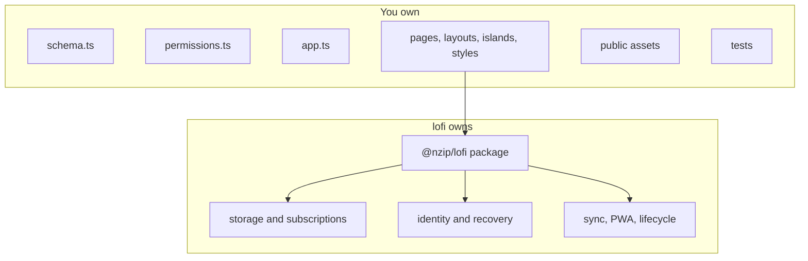

# lofi developer documentation

These guides are for developers building an application from the `@nzip/lofi` generated template.
They describe the checked-out package version and its generated project—not the older prototype
sketches under `docs/spikes/`.

## Start here

Work through the guides in order; each builds on the project state the previous one leaves behind.

| Step | Guide                                                           | What you do                                                                                                   |
| ---- | --------------------------------------------------------------- | ------------------------------------------------------------------------------------------------------------- |
| 1    | [Getting started](getting-started.md)                           | Scaffold an app, verify local persistence, and identify the files you are expected to change.                 |
| 2    | [Data and UI](data-and-ui.md)                                   | Connect a Jazz table to a typed Preact hook and island.                                                       |
| 3    | [Permissions](permissions.md)                                   | Understand and change the starter's owner-only access policy.                                                 |
| 4    | [Sync and recovery](sync-and-recovery.md)                       | Provision managed sync and understand the account lifecycle.                                                  |
| 5    | [Testing](testing.md)                                           | Run fast tests and the opt-in two-client offline convergence example.                                         |
| 6    | [Deployment](deployment.md)                                     | Build, preview, customize, and host the static PWA.                                                           |
| 7    | [Application-origin migration](application-origin-migration.md) | Move a deployed app across a browser security boundary with recovery, verification, rollback, and retirement. |

Blocked at any step — environment, browser, build, or test failures? Go straight to
[Troubleshooting](troubleshooting.md).

The root [README](https://github.com/FelineStateMachine/lofi/blob/main/README.md) provides the
shortest product overview and command summary. AI agents can ingest these docs as
[llms.txt](https://lofi.host/llms.txt) (index) or [llms-full.txt](https://lofi.host/llms-full.txt)
(complete corpus including the API reference).

## Reference

- [Commands](reference/commands.md)
- [Configuration](reference/configuration.md)
- [Generated project layout](reference/project-layout.md)
- [Identity and recovery model](auth-identity.md)
- [Account and access API](reference/access.md)
- Access template examples — who may touch which rows
  - [Direct sharing](examples/shared.md)
  - [Fixed-role group](examples/group.md)
  - [Policy conditions on typed columns](examples/policy-conditions.md)
- Data modeling examples — how to shape tables and columns
  - [Collaborative list data model](examples/collaborative-list.md)
  - [Collaborative sets](examples/collaborative-sets.md)
  - [Binary and structured payloads](examples/payloads.md)
  - [Schema evolution](examples/schema-evolution.md)
  - [Nested app namespaces](examples/nested-namespaces.md)
- [Store provisioning](store-provisioning.md)
- [lofi-node](https://lofi.host/node) — the sync node your **users** can run to own their data's
  location; tutorials, guides, and the node reference live in the site's `/node` section
- [Optional installed-app recipes](recipes/README.md)
- [Advanced device-auth primitive](auth.md)

## The author boundary

Generated projects intentionally divide application source from versioned framework code:

- Change `src/schema.ts`, `src/permissions.ts`, `src/app.ts`, `src/pages/`, `src/layouts/`,
  `src/islands/`, and `src/styles/`.
- Import documented runtime seams from `@nzip/lofi`; no framework implementation is copied into
  `src/`.
- Change files under `public/` when customizing the icon or manifest. The package build generates
  the service worker.
- Keep application tests under `tests/`.

## Framework contributor material

The following documents explain why lofi behaves as it does. They are useful when changing the
framework, but they are not application tutorials:

- [Developer-experience contract](https://github.com/FelineStateMachine/lofi/blob/main/docs/devx-contract.md)
- [Historical prototype seed](https://github.com/FelineStateMachine/lofi/blob/main/docs/seed.md)
- [`docs/spikes/`](https://github.com/FelineStateMachine/lofi/tree/main/docs/spikes) and retained
  evidence

Spike evidence records the state of an experiment at a specific commit and package pin. Preserve it
as historical evidence; do not update it to look like the current generated app.
