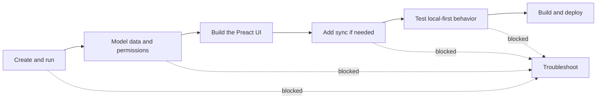
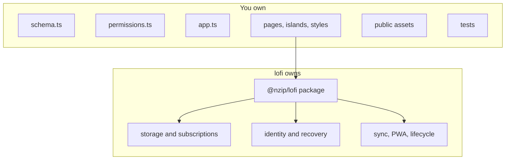

# lofi developer documentation

These guides are for developers building an application from the `@nzip/lofi` generated template.
They describe the checked-out package version and its generated project—not the older prototype
sketches under `docs/spikes/`.

## Start here

1. [Getting started](getting-started.md) — scaffold an app, verify local persistence, and identify
   the files you are expected to change.
2. [Data and UI](data-and-ui.md) — connect a Jazz table to a typed Preact hook and island.
3. [Permissions](permissions.md) — understand and change the starter's owner-only access policy.
4. [Sync and recovery](sync-and-recovery.md) — provision managed sync and understand the account
   lifecycle.
5. [Testing](testing.md) — run fast tests and the opt-in two-client offline convergence example.
6. [Deployment](deployment.md) — build, preview, customize, and host the static PWA.
7. [Troubleshooting](troubleshooting.md) — diagnose common environment, browser, build, and test
   failures.

The root [README](../README.md) provides the shortest product overview and command summary.

## Reference

- [Commands](reference/commands.md)
- [Configuration](reference/configuration.md)
- [Generated project layout](reference/project-layout.md)
- [Identity and recovery model](auth-identity.md)
- [Advanced device-auth primitive](auth.md)

## The author boundary

Generated projects intentionally divide application source from versioned framework code:

- Change `src/schema.ts`, `src/permissions.ts`, `src/app.ts`, `src/pages/`, `src/islands/`, and
  `src/styles/`.
- Import documented runtime seams from `@nzip/lofi`; no framework implementation is copied into
  `src/`.
- Change files under `public/` when customizing the icon or manifest. The package build generates
  the service worker.
- Keep application tests under `tests/`.

## Framework contributor material

The following documents explain why lofi behaves as it does. They are useful when changing the
framework, but they are not application tutorials:

- [Developer-experience contract](https://github.com/FelineStateMachine/lofi/blob/main/docs/devx-contract.md)
- [Historical prototype seed](https://github.com/FelineStateMachine/lofi/blob/main/docs/seed.md)
- [`docs/spikes/`](https://github.com/FelineStateMachine/lofi/tree/main/docs/spikes) and retained
  evidence

Spike evidence records the state of an experiment at a specific commit and package pin. Preserve it
as historical evidence; do not update it to look like the current generated app.
