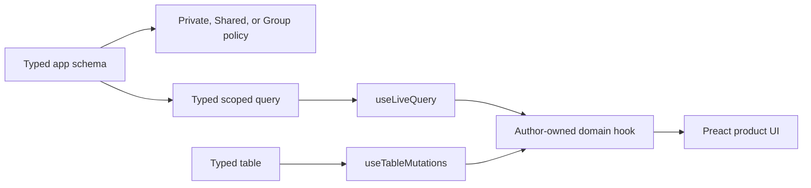

# Data and UI

Lofi keeps realtime plumbing out of product components. Authors declare tables and policies through
the lofi schema surface, build exact typed queries, and compose two package hooks inside a domain
hook:



The root package owns shared query stores, runtime recreation, subscription teardown, mutation
errors, and durability tracking. `@nzip/lofi/preact` owns only the Preact lifecycle adapter.

## Declare a table and policy

```ts
import { s } from "@nzip/lofi/schema";

const schema = {
  records: s.table({
    workspaceId: s.string(),
    title: s.string(),
    archived: s.boolean(),
    createdAt: s.timestamp(),
  }),
};

export const app = s.defineApp(schema);
```

`@nzip/lofi/schema` exports the pinned Jazz 2 schema DSL one-to-one — same names, same behavior — so
`src/schema.ts` and `src/permissions.ts` never import the vendor module and package upgrades absorb
upstream changes (see [the decision record](decisions/schema-facade-alpha53.md)). UI islands stay on
public package seams: derive row types with `RowOf` from `@nzip/lofi`
(`type Record = RowOf<typeof app.schema.records>`), and the generated author-boundary test rejects
raw `jazz-tools` imports in every author source file.

Every table needs a policy in `src/permissions.ts`. Permissions determine which rows enter a live
query and which mutations succeed; realtime access is not a separate permission mode. See
[Permissions](permissions.md), [direct sharing](examples/shared.md), and
[group ownership](examples/group.md).

## Bind an exact typed query

```ts
import { useLiveQuery } from "@nzip/lofi/preact";
import { app } from "../app.ts";

const records = useLiveQuery(
  () =>
    app.schema.records
      .where({ workspaceId, archived: false })
      .orderBy("createdAt", "desc"),
  [workspaceId],
);
```

The result preserves the row produced by the exact builder, including `select` and `include`
projections:

```ts
const titles = useLiveQuery(
  () => app.schema.records.select("title").where({ workspaceId }),
  [workspaceId],
);
// titles.rows contains id and title, not the unselected application columns.
```

Equivalent mounted queries share one Jazz subscription. When dependencies change, Lofi releases the
obsolete query before opening the replacement. The last consumer evicts the store. Runtime or
account recreation reconnects mounted queries and ignores callbacks from an obsolete client.

Read state is deliberately small:

| Field    | Values                      | Meaning                                  |
| -------- | --------------------------- | ---------------------------------------- |
| `status` | `loading`, `ready`, `error` | Subscription/read state                  |
| `rows`   | Exact typed query rows      | Current authorized result                |
| `error`  | Message or `null`           | Query setup or runtime acquisition error |

An empty array with `status: "ready"` is an empty result, not a loading signal.

## Mutate the underlying table

```ts
import { useTableMutations } from "@nzip/lofi/preact";

const records = useTableMutations(app.schema.records);
const created = await records.insert({
  workspaceId,
  title: "Release notes",
  archived: false,
  createdAt: new Date(),
});
await records.update(created.id, { archived: true });
await records.remove(created.id);
```

`insert` returns the created row, including its generated `id`. Mutation promises resolve only after
local durability. When managed sync is active, global confirmation continues in the background and
updates the shared table-scoped state:

| Field        | Values                              | Meaning                            |
| ------------ | ----------------------------------- | ---------------------------------- |
| `pending`    | Number                              | Local durability waits in progress |
| `durability` | `none`, `local`, `global`, `failed` | Latest mutation outcome            |
| `error`      | Message or `null`                   | Awaited or asynchronous rejection  |

Several filtered queries can observe the same table mutation without owning mutation listeners. All
`useTableMutations` consumers for one schema table share one listener and one state surface.

## Keep product UI domain-shaped

```ts
export function useWorkspaceRecords(workspaceId: string) {
  const query = useLiveQuery(
    () => app.schema.records.where({ workspaceId, archived: false }),
    [workspaceId],
  );
  const mutations = useTableMutations(app.schema.records);
  return {
    ...query,
    durability: mutations.durability,
    createRecord: (title: string) =>
      mutations.insert({
        workspaceId,
        title,
        archived: false,
        createdAt: new Date(),
      }),
    archiveRecord: (id: string) => mutations.update(id, { archived: true }),
  };
}
```

Components consume `createRecord` and `archiveRecord`; they do not call `getRuntime`, manage Jazz
subscriptions, or listen for runtime recreation. The generated task hook is the smallest working
example. For a complete access-aware composition, see the
[collaborative list recipe](examples/collaborative-list.md).

## Schema changes and migrations

Use `deno task schema:validate` while editing. For existing data, create and review a migration with
`deno task migrations:create`, then use `migrations:push` and `schema:deploy` only with the intended
managed configuration. Never put server-only secrets in source or browser code.
