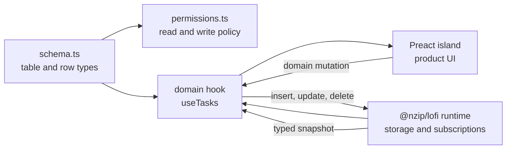
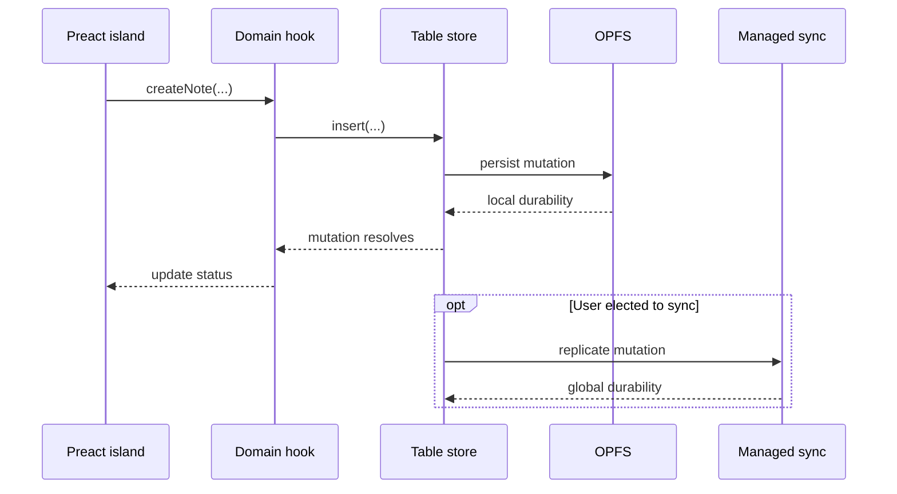

# Data and UI

The generated task list demonstrates lofi's main authoring pattern:



The runtime owns the database, durable storage, subscriptions, and sync lifecycle. The domain hook
selects a table and exposes product-specific reads and mutations to the UI.

## 1. Declare a table

`src/schema.ts` uses the pinned Jazz schema API directly:

```ts
import { schema as s } from "jazz-tools";

const schema = {
  notes: s.table({
    title: s.string(),
    body: s.string(),
    archived: s.boolean(),
    createdAt: s.timestamp(),
  }),
};

type AppSchema = s.Schema<typeof schema>;
export const app: s.App<AppSchema> = s.defineApp(schema);
```

Keep table names stable once data has shipped. A schema change can require a migration; validate the
schema and review the Jazz CLI output before deploying it.

## 2. Define permissions for the table

Every new table needs an explicit policy in `src/permissions.ts`. The starter policy lets a user
insert rows and limits reads, updates, and deletes to the row creator. See
[Permissions](permissions.md) before changing that boundary.

## 3. Bind the table to a typed hook

The generated `src/islands/use-tasks.ts` is the canonical example. Its important pieces are:

```ts
import { schema as s } from "jazz-tools";
import { getRuntime } from "@nzip/lofi";
import { app } from "../app.ts";

const notesTable = app.schema.notes;
export type Note = s.RowOf<typeof notesTable>;
```

`s.RowOf` derives the row type from the schema, including its `id`. Do not duplicate persisted row
types by hand.

When the hook connects, it asks the runtime for a shared store:

```ts
const runtime = await getRuntime();
const store = runtime.store(notesTable);
```

Repeated calls for the same table return the same store. Multiple consumers therefore share one
underlying Jazz subscription.

Use the generated hook's subscription and cleanup structure rather than opening a raw Jazz
subscription in a component. It handles unmounting and reconnects after a user enables sync or
restores another account.

## 4. Expose domain mutations

The table store provides three mutations:

```ts
await store.insert({ title, body, archived: false, createdAt: new Date() });
await store.update(noteId, { archived: true });
await store.delete(noteId);
```

Wrap these in domain verbs such as `createNote`, `archiveNote`, and `deleteNote`. Product components
should not need to know which table or runtime implements them.

Each mutation waits for local durability before its promise resolves. When the user has elected to
sync, the store also tracks global durability in the background.



## 5. Render every state honestly

A table snapshot contains:

| Field        | Values                              | Meaning                         |
| ------------ | ----------------------------------- | ------------------------------- |
| `status`     | `loading`, `ready`, `error`         | Subscription/read state         |
| `rows`       | Typed row array                     | Current local view              |
| `durability` | `none`, `local`, `global`, `failed` | Most recent mutation durability |
| `error`      | A message or `null`                 | Read or mutation failure        |

Render loading and failure states rather than treating an empty row array as proof that loading
finished. A locally durable write is safe in device storage; a globally durable write has also
reached configured sync.

## Schema changes and migrations

Generated projects provide these Jazz CLI tasks:

```sh
deno task schema:validate
deno task migrations:create
deno task migrations:push
deno task schema:deploy
```

Use `schema:validate` while editing. When a change affects existing data, use the migration command
to create the migration under `src/migrations/`, review the generated change, and test it against
non-sensitive fixture data before pushing or deploying it.

`migrations:push` and `schema:deploy` use the managed Jazz configuration in `.env`. Never paste its
server-only secrets into source, client code, screenshots, or issue text.
