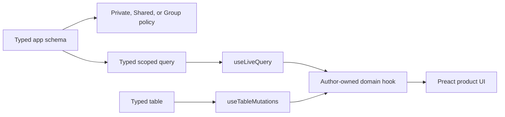

# Data and UI

Lofi keeps realtime plumbing out of product components. Authors declare tables and policies through
the lofi schema surface, build exact typed queries, and compose two package hooks inside a domain
hook:



The root package owns shared query stores, runtime recreation, subscription teardown, mutation
errors, and durability tracking. `@nzip/lofi/preact` owns only the Preact lifecycle adapter.

## Declare a table and policy

```ts
import { s } from "@nzip/lofi/schema";

const schema = {
  records: s.table({
    workspaceId: s.string(),
    title: s.string(),
    archived: s.boolean(),
    createdAt: s.timestamp(),
  }),
};

export const app = s.defineApp(schema);
```

`@nzip/lofi/schema` exports the pinned Jazz 2 schema DSL one-to-one — same names, same behavior — so
`src/schema.ts` and `src/permissions.ts` never import the vendor module and package upgrades absorb
upstream changes (see [the decision record](decisions/schema-facade-alpha53.md)). UI islands stay on
public package seams: derive row types with `RowOf` from `@nzip/lofi`
(`type Record = RowOf<typeof app.schema.records>`), and the generated author-boundary test rejects
raw `jazz-tools` imports in every author source file.

Every table needs a policy in `src/permissions.ts`. Permissions determine which rows enter a live
query and which mutations succeed; realtime access is not a separate permission mode. See
[Permissions](permissions.md), [direct sharing](examples/shared.md), and
[group ownership](examples/group.md).

## Column palette

Every column constructor below is exercised against the real pinned engine by the conformance suite
(`deno task test:conformance`); a member that only compiles is not part of the supported surface.

| Constructor        | Row value                | Notes                                          |
| ------------------ | ------------------------ | ---------------------------------------------- |
| `s.string()`       | `string`                 | Unicode round-trips.                           |
| `s.boolean()`      | `boolean`                |                                                |
| `s.int()`          | `number`                 | i32 range only at runtime; see below.          |
| `s.float()`        | `number`                 | Double precision.                              |
| `s.timestamp()`    | `Date`                   | Storage round-trips; do not filter on it yet.  |
| `s.enum("a", "b")` | Union of the literals    |                                                |
| `s.bytes()`        | `Uint8Array`             | Keep payloads at 32 bytes or more; see below.  |
| `s.json()`         | Any JSON value           | Nested objects and arrays round-trip.          |
| `s.array(inner)`   | Array of the inner value |                                                |
| `s.ref("table")`   | Referenced row id        | Filterable foreign key: `where({ parentId })`. |

Constraints of the pinned alpha, each pinned by a conformance test that fails when upstream lifts
it:

- **`s.int()` accepts only the i32 range at runtime.** Despite the `number` static type, values
  outside ±2³¹ are rejected with `InvalidArg … expected i32`.
- **Timestamp `where`-equality matches every row** instead of filtering, so query timestamps by id
  or another column for now.
- **Byte payloads under 32 bytes are unreliable**; pad short payloads or store them as `s.json()`.

### Column modifiers and merge strategies

Modifiers chain on any constructor: `.optional()` makes the column nullable, `.default(value)` fills
omitted inserts, and `.merge(strategy)` picks a conflict strategy for concurrent writers.
`.transform({ from, to })` (experimental upstream) maps stored values to a different TypeScript view
type: inserts, reads, and updates use the view type, while `where` filters address the stored
representation. In the pinned alpha `.merge()` and `.transform()` return the untyped builder (the
legacy untyped signatures shadow the typed overloads), which degrades the whole table's row types —
cast the result back to the intended column type; the runtime object is unchanged:

```ts
import { type ArrayColumn, type IntColumn, s } from "@nzip/lofi/schema";

export const app = s.defineApp({
  tagged: s.table({
    name: s.string(),
    tags: s.array(s.string()).merge("g-set") as unknown as ArrayColumn<"TEXT">,
  }),
});
```

The pinned alpha ships exactly three merge strategies — `"lww"` (the default), `"counter"`, and
`"g-set"` — and they are the whole collaborative-value surface: Jazz 2 has no successor to the 1.x
CoValue types (`co.map`, CoText, FileStream). All three are verified with two synced clients in
`package/schema/merge_sync_test.ts`:

- **`"lww"` (the default) works**: with or without an explicit `.merge("lww")`, a concurrent
  conflict resolves to the last write to reach the server, and live replicas and fresh boots agree.
- **`"g-set"` works**: concurrent writers union their elements and every replica — including a fresh
  boot — converges on the same set. Keep a g-set table in its own single-table app for now; in the
  pinned alpha a g-set column destabilizes writes to sibling tables in the same app. See the
  [collaborative sets example](examples/collaborative-sets.md).
- **`"counter"` is not dependable yet**: the server keeps the last causally ordered update value and
  sums only concurrent updates, while live replicas add every update as a delta, so a replica that
  watched the history diverges permanently from what a fresh boot reads. Avoid counter columns until
  an alpha bump clears the pins (see [the decision record](decisions/schema-facade-alpha53.md)).

### Encrypted columns

`s.encryptedText(label)`, `s.encryptedJson<T>(label)`, `s.encryptedNumber(label)`, and
`s.encryptedDate(label)` seal a field on the client before it enters Jazz: the sync store holds
versioned ciphertext (XChaCha20-Poly1305, a per-column subkey derived from the account secret), so
the store operator sees that the column exists — writers, timestamps, size classes — but never its
content. Plaintext is padded to bucketed sizes before sealing, so stored lengths reveal which size
class a value falls in rather than its exact length; every short scalar shares one class. The
runtime installs the key at boot; touching an encrypted column before then fails closed rather than
writing plaintext.

```ts
notes: s.table({
  title: s.string(),
  body: s.encryptedText("notes.body"),
  attachments: s.encryptedJson<{ name: string; size: number }[]>("notes.attachments"),
  balance: s.encryptedNumber("notes.balance"),
  reviewedAt: s.encryptedDate("notes.reviewedAt"),
}),
```

Sealed numbers view as `number` and sealed dates as `Date`, matching their plaintext counterparts;
because the stored representation is text, sealed numbers are not subject to the 32-bit limit of
plain integer columns. Non-finite numbers and invalid dates are rejected at write time.

The `label` is the column's cryptographic identity, conventionally `"table.column"`: it binds the
ciphertext to the column (a value replayed into another column refuses to open) and changing it
later makes existing values unreadable — treat it like a column name. Constraints to design around:

- **Account-private.** The key derives from the account secret, so every device holding the account
  decrypts and nobody else does — including other members of a shared group. A row read under a
  different account throws `EncryptedColumnError` instead of returning garbage. Fields the whole
  group should read use [shared encrypted columns](#shared-encrypted-columns) instead.
- **Not filterable, not policy-visible — enforced.** A `where` on an encrypted column is a compile
  error (the column type is excluded from filter positions), and a permission policy referencing one
  fails configuration with `AccessError` — the server cannot evaluate what it cannot read. Gate on
  plaintext columns beside it. For filtering, rows reaching your code are already decrypted, so
  match them client-side with `matchDecrypted` from `@nzip/lofi/schema`: narrow the query with
  plaintext filters first, then apply the predicate, and only then any limit (a `limit()` before the
  predicate under-fetches). Sort returned rows in code rather than ordering by an encrypted column —
  ciphertext order is arbitrary.
- **No chaining modifiers.** `.default()`, `.merge()`, `.transform()`, and `.optional()` are compile
  errors on encrypted columns: a default would be applied below the seal boundary as plaintext,
  merge strategies and transforms cannot operate on ciphertext, and optional stays disabled until
  the engine's null handling of transformed columns is pinned.

#### Encrypt by default: `s.privateTable`

`s.privateTable(labelPrefix, columns)` inverts the posture from "encrypt what is sensitive" to
"expose what the server needs": every column seals by default, and plaintext is the explicit choice.
Labels derive as `"prefix.column"` — treat the prefix like the table name and never reuse it across
tables.

```ts
notes: s.privateTable("notes", {
  body: s.string(), // sealed: encryptedText("notes.body")
  score: s.int(), // sealed: encryptedNumber("notes.score") — no i32 limit
  reviewedAt: s.timestamp(), // sealed: encryptedDate("notes.reviewedAt")
  meta: s.json(), // sealed: encryptedJson("notes.meta")
  workspaceId: s.ref("workspaces"), // plaintext: foreign keys stay joinable
  title: s.plain(s.string()), // plaintext by author choice: a filter target
}),
```

Reference columns stay plaintext automatically — a foreign key the server cannot read cannot join or
gate. `s.plain(column)` marks a deliberate plaintext column (a filter, sort key, or policy target)
at the column it affects. Byte columns stay plaintext with a report — store byte payloads as base64
in an encrypted json column to seal them. A column already sealed with an explicit `s.encrypted*`
keeps its own label. Optionals, defaults, non-lww merge strategies, and transforms on sealed columns
are configuration errors: each would either leak plaintext below the seal boundary or silently
discard author intent.

### Shared encrypted columns

`s.sharedEncryptedText(label, options)` and `s.sharedEncryptedJson<T>(label, options)` seal a field
under a **group field key**: every member of the group holding the key reads it; the store operator
never does. The key travels as ordinary synced data — wrapped to each member's public key, published
in a key directory, delivered through the group's wrapped-key table — so the server relays key
material it cannot open, and substituting keys is a detected active attack rather than silent
reading.

```ts
const schema = {
  workspaces: s.table({ name: s.string() }),
  workspaceMembers: groupMembershipTable("workspaces"),
  workspaceFieldKeys: sharedFieldKeyTable("workspaces"),
  keyDirectory: sharedFieldDirectoryTable(),
  docs: s.table({
    workspaceId: s.ref("workspaces"),
    title: s.string(),
    body: s.sharedEncryptedText("docs.body", {
      group: "workspaces",
      groupIdColumn: "workspaceId",
      keys: "workspaceFieldKeys",
      directory: "keyDirectory",
    }),
  }),
};
```

The two helper tables come from `@nzip/lofi/access` and get their policies from
`sharedFieldAccess({ directory })` and the `fieldKeys` option of `groupAccess`; group operations
created with `fieldKeys`/`directory` tables then mint, deliver, and rotate keys automatically —
creation bootstraps the first key, an arriving member receives every held generation, and removal
rotates to a generation the removed member never receives.

**Reads are state-valued.** A shared column's row value is a `SharedFieldValue<T>`:
`{ state: "ready", value }` once the key is installed, `{ state: "pending-key" }` while the wrap is
still in flight — the normal condition of a freshly added member — and `{ state: "corrupt" }` when
authentication fails. Render the pending state; never treat it as an error. Live queries
re-materialize automatically when the key arrives. `sharedFieldReady` narrows, and
`unwrapSharedField` throws for callers who prefer exceptions.

**Writes go through lofi's write path** — the store or a declared verb — which resolves the row's
group from `groupIdColumn` and seals under the newest key this device holds before anything is
journaled. A write that bypasses the framework fails closed rather than storing plaintext. An update
that patches a shared column must include the group column in the verb path (the synchronous journal
cannot fetch the row); the store path fetches it automatically.

Constraints to design around, in addition to everything that applies to encrypted columns:

- **Removal is lazy rekey.** A removed member never receives keys minted after their removal, so
  content written afterwards is sealed to them — but generations they already held keep opening,
  because they already possess that key material and re-encrypting CRDT history is unsound under
  concurrent merges. Removal protects future content.
- **Key delivery is asynchronous.** A new member reads `pending-key` until a device holding the key
  comes online and wraps for them; `reconcileSharedFieldKeys` on the group operations repairs
  missing wraps. Members who have not yet published a directory entry cannot receive keys.
- **Substitution is detected, not prevented.** Peer keys pin on first sight per device, and a
  sharing identity minted by a shared-field-capable app carries the account's key fingerprint, so
  members added person-to-person are pinned with no server first-sight window. A key that later
  disagrees surfaces in `diagnostics.sharedFieldAlerts` and its wraps are refused until the user
  explicitly re-trusts.

## Bind an exact typed query

```ts
import { useLiveQuery } from "@nzip/lofi/preact";
import { app } from "../app.ts";

const records = useLiveQuery(
  () =>
    app.schema.records
      .where({ workspaceId, archived: false })
      .orderBy("createdAt", "desc"),
  [workspaceId],
);
```

The result preserves the row produced by the exact builder, including `select` and `include`
projections:

```ts
const titles = useLiveQuery(
  () => app.schema.records.select("title").where({ workspaceId }),
  [workspaceId],
);
// titles.rows contains id and title, not the unselected application columns.
```

Equivalent mounted queries share one Jazz subscription. When dependencies change, Lofi releases the
obsolete query before opening the replacement. The last consumer evicts the store. Runtime or
account recreation reconnects mounted queries and ignores callbacks from an obsolete client.

Read state is deliberately small:

| Field    | Values                      | Meaning                                  |
| -------- | --------------------------- | ---------------------------------------- |
| `status` | `loading`, `ready`, `error` | Subscription/read state                  |
| `rows`   | Exact typed query rows      | Current authorized result                |
| `error`  | Message or `null`           | Query setup or runtime acquisition error |

An empty array with `status: "ready"` is an empty result, not a loading signal.

## Mutate the underlying table

```ts
import { useTableMutations } from "@nzip/lofi/preact";

const records = useTableMutations(app.schema.records);
const created = await records.insert({
  workspaceId,
  title: "Release notes",
  archived: false,
  createdAt: new Date(),
});
await records.update(created.id, { archived: true });
await records.remove(created.id);
```

Each method returns a thenable `WriteHandle`: awaiting `insert` resolves with the created row,
including its generated `id`, once the write is durable on this device. The handle's `saved` and
`synced` promises and its `stage` property expose the write's sync fate; named verbs with effect
handlers build on the same lifecycle — see [Nouns and verbs](nouns-and-verbs.md). When managed sync
is active, global confirmation continues in the background and updates the shared table-scoped
state:

| Field        | Values                              | Meaning                            |
| ------------ | ----------------------------------- | ---------------------------------- |
| `pending`    | Number                              | Local durability waits in progress |
| `durability` | `none`, `local`, `global`, `failed` | Latest mutation outcome            |
| `error`      | Message or `null`                   | Awaited or asynchronous rejection  |

Several filtered queries can observe the same table mutation without owning mutation listeners. All
`useTableMutations` consumers for one schema table share one listener and one state surface.

## Keep product UI domain-shaped

```ts
export function useWorkspaceRecords(workspaceId: string) {
  const query = useLiveQuery(
    () => app.schema.records.where({ workspaceId, archived: false }),
    [workspaceId],
  );
  const mutations = useTableMutations(app.schema.records);
  return {
    ...query,
    durability: mutations.durability,
    createRecord: (title: string) =>
      mutations.insert({
        workspaceId,
        title,
        archived: false,
        createdAt: new Date(),
      }),
    archiveRecord: (id: string) => mutations.update(id, { archived: true }),
  };
}
```

Components consume `createRecord` and `archiveRecord`; they do not call `getRuntime`, manage Jazz
subscriptions, or listen for runtime recreation. The generated task hook is the smallest working
example. For a complete access-aware composition, see the
[collaborative list data model](examples/collaborative-list.md).

## Schema changes and migrations

Use `deno task schema:validate` while editing. For existing data, create and review a migration with
`deno task migrations:create`, then use `migrations:push` and `schema:deploy` only with the intended
managed configuration. Never put server-only secrets in source or browser code. The
[schema evolution example](examples/schema-evolution.md) walks through a verified two-version
migration — add, drop, rename, and table rename — in both directions.
