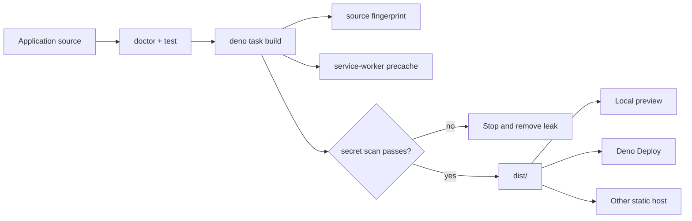

# Building and deploying a lofi app

lofi produces a static PWA. The production build contains prerendered HTML, JavaScript, the Jazz
WASM/runtime assets, the web manifest, and a revisioned service worker.



## Build and preview

```sh
deno task build
deno task preview
```

`build` writes `dist/`, records a source fingerprint in `dist/lofi-build.json`, stamps the schema
compatibility manifest in `dist/lofi-schema.json`, generates the precache list, and scans for
server-secret values. Before Astro starts, the shared doctor preflight validates the author-owned
manifest and referenced assets. After Astro finishes, build verifies the emitted HTML links,
manifest, icons, nested routes, worker revision/scope, build identity, schema manifest, and exact
precache set together. `preview` refuses to start when the build identity is missing or invalid.

To use another preview port:

```sh
deno task preview --port 4173
```

## Configure the public application surface

Before deploying, review:

- `src/app.ts` — name, database namespace, stable credential origins, and repository URL;
- `public/manifest.webmanifest` — stable install identity, locale, icons, colors, launch behavior,
  and shortcuts;
- `public/favicon.svg` and any added icon files;
- page titles, descriptions, and starter copy;
- `.env` — either no public Jazz pair for local-only mode or a complete pair for optional sync.

The default deployment base is `/`. When a static host mounts the application below the origin root,
set the path once in `.env` before running `dev` or `build`:

```dotenv
LOFI_BASE_PATH=/field-notes/
```

The value must be an absolute path, not an origin. Lofi feeds it into Astro's `base` setting and
uses the resulting base for public asset links, the manifest, the service worker, its scope, build
identity, and local preview. Upload the contents of `dist/` to that same mount point. A root build
and a subpath build are different deployment artifacts; rebuild after changing `LOFI_BASE_PATH`.

Run `deno task doctor` and `deno task test` before the production build.

### Customize the web manifest before launch

Treat `public/manifest.webmanifest` as product source, not generated build metadata. Before users
install the app:

- replace `name`, `short_name`, `description`, `id`, `lang`, and `dir` with product values;
- choose an `id` URL token that will remain stable for the lifetime of the installed app; unlike
  `start_url`, it identifies the app and does not need to be a navigable page;
- keep `scope`, `start_url`, every shortcut URL, and every shortcut icon aligned with the deployed
  base path;
- replace the regular, maskable, Apple touch, and transparent monochrome icon assets while keeping
  their purposes intact;
- keep `orientation: "any"` unless the product genuinely needs a screen-orientation lock; and
- replace or remove the starter `Open tasks` shortcut when replacing the task example.

After launch, changing the name or start page is routine; changing `id` can make a browser treat the
manifest as a different installed application. Choose it once. If the product ships in multiple
languages, keep the default strings plus `lang` and `dir`, then add language maps such as
`name_localized`, `short_name_localized`, and `description_localized`. Localized values whose text
direction differs from the manifest default should declare their own `dir`.

Storefront metadata is optional and product-specific. Add lowercase `categories` only when they
truthfully describe the finished app. Add `iarc_rating_id` only after obtaining a real IARC
certification code; never copy a placeholder rating. Experimental capabilities such as file,
protocol, share-target, and launch handlers are deliberately absent from the starter and should be
added only with matching product behavior and tests. Use the
[installed-app recipe catalog](recipes/README.md) for the supported opt-in patterns.

### Replace or remove install presentation

The starter manifest includes one labeled `540x720` narrow screenshot, one labeled `1280x720` wide
screenshot, and one **Open tasks** shortcut. They are examples of the real generated app, not
generic promotional art. Before launch:

- replace both screenshots with current product captures and update each `sizes`, `label`, and
  `form_factor`, or remove the entire `screenshots` member and both files;
- replace the shortcut name, description, route, and icon with one useful product entry point, or
  remove the entire `shortcuts` member;
- keep shortcut routes inside manifest scope and backed by a prerendered route so they cold-start
  offline; and
- keep shortcut icons inside scope with truthful MIME types and dimensions.

Build validation checks every referenced asset, requires labeled narrow and wide variants when the
`screenshots` member is present, and rejects shortcut routes that were not emitted. Screenshots are
deliberately excluded from the required shell precache; deleting promotional captures cannot break
offline startup.

The starter does not claim a Web Share Target. If a product opts in, follow the tested
[Web Share recipe](recipes/web-share.md): first add a same-scope, prerendered action route, then add
a manifest member such as:

```json
{
  "share_target": {
    "action": "./share/",
    "method": "GET",
    "enctype": "application/x-www-form-urlencoded",
    "params": { "title": "title", "text": "text", "url": "url" }
  }
}
```

Use `parseTextShareTarget()` in the receiving island to ignore unknown parameters, reject duplicate
or oversized values, and accept a shared URL only after parsing it and allow-listing `https:` and
`http:`. Present the result as a draft: receiving a share is not user confirmation to persist it.
Build validation rejects malformed declarations, POST/file shares without a matching worker recipe,
and action routes that were not emitted for offline startup.

## Deno Deploy

Create the static application once:

```sh
deno task deploy:create --org <org> --app <app>
```

For later releases:

```sh
deno task deploy
```

Both tasks build first and deploy `dist/` as the static root.

## Other static hosts

Upload the contents of `dist/` to any host that can:

- serve `index.html` at the application root;
- preserve the manifest and WASM content types;
- serve the application over HTTPS;
- keep the service worker at the intended scope;
- fall back to the appropriate prerendered HTML for application routes.

Every prerendered route is included in the shell precache. While offline, a direct navigation such
as `/field-notes/settings/` resolves its cached `settings/index.html`; if that route was not
emitted, the worker falls back to the cached application root.

The app is the only thing that needs hosting: sync is optional infrastructure the user can point at
a managed Jazz app or at [a self-hosted sync node](/node) they run themselves — the deployment does
not change either way.

### Content-Security-Policy

Every built page carries a strict Content-Security-Policy in a `<meta>` tag: scripts and styles are
admitted only from the app's own origin plus the exact hashes of the inline island bootstraps, with
`'wasm-unsafe-eval'` for the sync engine's WebAssembly and `object-src 'none'`, `base-uri 'self'`,
`worker-src 'self'` alongside. The meta tag enforces on every host, including hosts that cannot set
response headers — on those, it is the effective mechanism. Where your host supports response
headers, mirror the policy as a real `Content-Security-Policy` header using the generated
`dist/_headers.example`: a header additionally covers `frame-ancestors` (ignored in meta by spec)
and governs the service worker's own execution. `deno task preview` sends the header so the header
path is exercised before deployment.

Tuning happens through the environment at build time: `LOFI_CSP_SCRIPT_SRC`, `LOFI_CSP_STYLE_SRC`,
and `LOFI_CSP_DIRECTIVES` extend the policy (space-separated sources; semicolon-separated
directives), `LOFI_CSP_CONNECT_SRC` pins the sync origin for apps with a fixed managed sink — note
that pinning it breaks runtime enrollment to any other node, which is why it is not set by default
(the sync location is user data, not build configuration) — and `LOFI_CSP=off` disables the policy
entirely. The build reports the shipped policy and warns on weakenings (`'unsafe-inline'`, remote
script origins, missing pages, or a disabled policy); what ships is the author's call.

### Offline cache policy

The build's precache manifest contains required shell resources only. Mutable shell assets (HTML,
manifests) are fetched bypassing the HTTP cache (matching the manifest's own `no-store` fetch), so a
new revision can never be populated from stale HTTP-cached responses. Content-hashed build assets
under `_astro/` cannot go stale under their names, so precaching admits the HTTP cache for them: a
first visit reuses the bytes the page's own module and engine fetches already downloaded instead of
downloading the shell a second time. If any listed response cannot be fetched, service-worker
installation fails and reports a precache error rather than exposing a worker that cannot cold-start
the application. Product-specific optional resources do not belong in that manifest.

Cache names carry the registration scope, and lookups consult only the worker's own caches: apps
served from different base paths on one origin never read, shadow, or delete each other's caches,
and activation prunes only the current scope's previous revisions. Requests carrying a `Range`
header are left to the network — a cached complete response cannot answer a partial request.

Runtime caching is a separate, best-effort policy. It accepts only successful, public, same-origin
responses inside the worker scope for fonts, images, scripts, styles, and workers. Navigation,
cross-origin requests, partial responses, `private` or `no-store` responses, and `Vary: *` responses
are not added. The cache retains at most 64 entries, moves refreshed URLs to the end, evicts the
oldest inserted overflow, and removes the current scope's previous build revisions during
activation.

Navigation preload remains disabled: generated routes and their assets are precached, so starting a
parallel network request before the normal cache-first lookup would spend bandwidth on the expected
offline-ready path. Jazz sync, OPFS storage, background sync, and push remain outside the worker.

### First-visit download

A repeat visit opens from the precached shell without touching the network. A cold first visit is
dominated by the Jazz engine binary, so the build stamps every prerendered page with a fetch preload
for it: the download starts while the module graph is still arriving, and the tag carries the
binary's uncompressed size. Before the runtime opens it streams that same URL with byte progress,
and the engine's own fetch then reads the primed HTTP cache. Applications can name the wait with the
`useBootProgress` hook in `@nzip/lofi/preact` (phases `pending`, `downloading`, `opening`, `ready`,
`failed`, with `loadedBytes` and `totalBytes` while downloading); the starter task list shows the
pattern. Serving `_astro/` assets with compression and long-lived caching headers keeps both the
first visit and the warm-up cheap.

### Install and update lifecycle

The optional `PwaActions` UI uses a browser prompt only while `beforeinstallprompt` is actually
available. iOS receives its Share-menu steps. Other secure browsers with service-worker support get
generic browser-menu guidance that says to use **Install app** or **Add to Home Screen** only if the
browser offers it; an insecure or unsupported context is reported separately.

When the app returns to the foreground, restores from the back-forward cache, or reconnects, Lofi
asks the active service-worker registration to check for an update. Checks share one in-flight
request, time out, and are rate-limited. Update state moves through `checking`, `installing`,
`ready`, and `applying`; a waiting worker activates only after the user chooses **Update app**. Once
the new worker takes control, every claimed tab reloads — the new worker prunes the old revision's
caches, so a document left on the old HTML and module graph would go stale — not only the tab that
chose the update. The first claim of a previously uncontrolled page does not reload, and a document
reloads at most once, so ordinary worker changes cannot create a reload loop.

Foreground recovery reconnects managed sync only while the current account has elected sync and the
development inspector has not paused the transport; a configured server alone is not consent to
resume replication.

A runtime-cache write error is best-effort and leaves the active worker ready. Registration,
required precache, and activation failures remain worker failures; update-check failures leave the
current worker running and retry on a later foreground signal.

### Installed apps get their own storage container

On iOS, iPadOS, and macOS, **Add to Home Screen** and **Add to Dock** create the installed web app
in a separate storage container. WebKit copies cookies at install time; OPFS, IndexedDB, and
localStorage stay behind in the browser. Local data created in a Safari tab before installing is
therefore not visible in the installed app — the data is safe in Safari's container, but the
installed app starts empty. Desktop installs isolate differently: a Chromium installed app shares
the storage of the browser profile that installed it (installing does not fork data), but each
browser keeps its own copy, so a site used in Chrome and installed from Edge holds two independent
local instances.

The framework covers the WebKit fork on both sides of the boundary:

- **Before installing.** While a browser context holds local-only data (writes that do not replicate
  because sync has not been elected), the iOS install guidance in `PwaActions` leads with a warning:
  installing opens a fresh copy, so back up or turn on sync first and restore in the installed app.
- **After installing.** While data is at risk, the runtime maintains a per-app flag cookie, the one
  signal WebKit copies at install. A standalone launch whose local storage has never been touched
  but which inherited that flag detects the fork and renders a fixed notice
  (`.lofi-storage-fork-banner`) naming where the data lives and the recovery path. Dismissing the
  notice clears the flag in the installed container and starts fresh.

Apps can restyle the notice via its class, or replace both surfaces entirely: suppress the default
notice with `pwa: { forkNotice: "none" }` in `defineLofiApp` and render a custom surface from the
`useStorageFork` hook in `@nzip/lofi/preact` (states: `unarmed`, `idle`, `browser-data-at-risk`,
`fork-detected`). The `DeviceStatus` panel reports the same verdict in its PWA section.

Two limits are inherent to the mechanism. The cookie copy is one-time at install, so nothing the
browser does afterwards reaches an already-installed container. And Safari caps script-set cookies
at seven days; the runtime refreshes the flag on every boot while data is at risk, but a user who
last visited the browser tab more than a week before installing gets no post-install notice. The
pre-install warning does not depend on the cookie and always applies. The recovery steps live in
[Troubleshooting](troubleshooting.md#the-installed-app-opened-empty-after-add-to-home-screen).

### Schema compatibility and read-only mode

The app shell and the local data version independently: a browser can hold an old cached shell next
to data another tab or device already migrated to a newer schema. Booting old code read-write onto
newer data is a defect, so lofi couples the two at build time and gates boot on the comparison.

Every build stamps `dist/lofi-schema.json` with the schema range the bundle understands: a
fingerprint of the compiled schema (the head) plus fingerprints of every committed migration
snapshot under `src/migrations/snapshots/` (the lineage). The file ships in the precache, so an
offline shell always knows its own range. On each read-write boot the runtime records that range in
`localStorage` beside the store — readable before the runtime opens.

On boot the gate compares the two:

- **Code ahead of data** (the local record is in the bundle's lineage): the normal path. Migrations
  run as they always have, and the record advances to the new head.
- **Data ahead of code** (the bundle's head is in the local record's lineage): the shell is older
  than the data. The gate refuses table writes, surfaces the state through runtime diagnostics and
  the `DeviceStatus` panel, and prompts an update check. Reads continue — the app stays usable for
  looking things up, and nothing is lost; boot is never hard-failed by the gate.
- **Unrelated histories** (neither contains the other, e.g. a schema change shipped without its
  migration snapshot): treated like data-ahead. Writes stay refused until a bundle that knows the
  data's schema arrives.

For users, read-only mode means edits are declined with the message "data was saved by a newer
version of the app"; updating the app (or reloading once the update installs) restores editing. The
refusal reaches application code as a `SchemaCompatibilityError` on the mutation promise, the same
surface as any other write failure.

By default the framework renders a minimal fixed banner (`.lofi-schema-compat-banner`) with the
message and an update/reload action. Apps can restyle it via that class, or replace it entirely:
suppress it with `pwa: { updateBanner: "none" }` in `defineLofiApp` and render a custom surface from
the `useSchemaCompat` hook in `@nzip/lofi/preact` (states: `unchecked`, `compatible`, `data-ahead`,
`updating`).

Applying an update coordinates across tabs on the same registration scope. The initiating tab
announces the swap on a scope-keyed BroadcastChannel; every tab pauses new local writes for a
bounded window while in-flight writes settle under a scope-keyed Web Lock, and only then is the
waiting worker activated. Afterwards, tabs that did not initiate the update reload by default;
`pwa: { staleTabs: "prompt" }` keeps their documents open instead, read-only, with a reload prompt.
Channel and lock names carry the scope key exactly like the cache names, so sibling lofi apps on one
origin never coordinate with each other by accident. Browsers without BroadcastChannel or Web Locks
fall back to the bounded pause alone.

In development the gate is inert, and a deployment without `lofi-schema.json` (built before the
manifest existed) leaves writes enabled — the protection begins with the first build that ships the
manifest.

Do not run a server-side Jazz credential in the static host or expose `JAZZ_ADMIN_SECRET` or
`BACKEND_SECRET` as public environment variables.

## Stable origins matter

Durable storage and service workers require a secure context outside localhost. WebAuthn credentials
also bind to the hostname. Choose the permanent production hostname before relying on device
credentials, add it to `credentialOrigins`, and avoid redirect or preview URLs that change between
deployments.

## Release verification

On the deployed HTTPS URL:

1. Confirm the device capability panel passes.
2. Add data, reload, and restart the browser.
3. Install the PWA and perform an offline cold start.
4. If sync is configured, opt in with a throwaway account and verify another device can recover it.
5. Inspect the built application for the expected version/source fingerprint.
