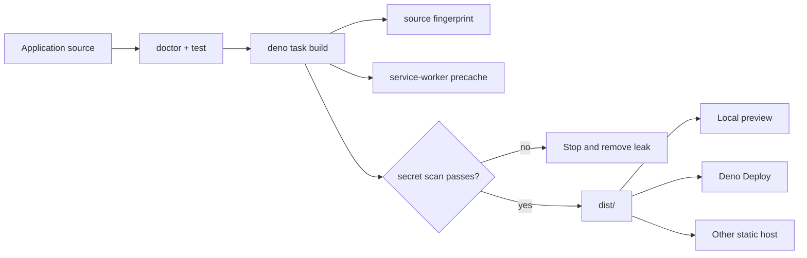

# Building and deploying a lofi app

lofi produces a static PWA. The production build contains prerendered HTML, JavaScript, the Jazz
WASM/runtime assets, the web manifest, and a revisioned service worker.



## Build and preview

```sh
deno task build
deno task preview
```

`build` writes `dist/`, records a source fingerprint in `dist/lofi-build.json`, generates the
precache list, and scans for server-secret values. `preview` refuses to start when the build
identity is missing or invalid.

To use another preview port:

```sh
deno task preview --port 4173
```

## Configure the public application surface

Before deploying, review:

- `src/app.ts` — name, database namespace, stable credential origins, and repository URL;
- `public/manifest.webmanifest` — installed name, icons, colors, start URL, and display mode;
- `public/favicon.svg` and any added icon files;
- page titles, descriptions, and starter copy;
- `.env` — either no public Jazz pair for local-only mode or a complete pair for optional sync.

The default deployment base is `/`. When a static host mounts the application below the origin root,
set the path once in `.env` before running `dev` or `build`:

```dotenv
LOFI_BASE_PATH=/field-notes/
```

The value must be an absolute path, not an origin. Lofi feeds it into Astro's `base` setting and
uses the resulting base for public asset links, the manifest, the service worker, its scope, build
identity, and local preview. Upload the contents of `dist/` to that same mount point. A root build
and a subpath build are different deployment artifacts; rebuild after changing `LOFI_BASE_PATH`.

Run `deno task doctor` and `deno task test` before the production build.

## Deno Deploy

Create the static application once:

```sh
deno task deploy:create --org <org> --app <app>
```

For later releases:

```sh
deno task deploy
```

Both tasks build first and deploy `dist/` as the static root.

## Other static hosts

Upload the contents of `dist/` to any host that can:

- serve `index.html` at the application root;
- preserve the manifest and WASM content types;
- serve the application over HTTPS;
- keep the service worker at the intended scope;
- fall back to the appropriate prerendered HTML for application routes.

Every prerendered route is included in the shell precache. While offline, a direct navigation such
as `/field-notes/settings/` resolves its cached `settings/index.html`; if that route was not
emitted, the worker falls back to the cached application root.

### Offline cache policy

The build's precache manifest contains required shell resources only. If any listed response cannot
be fetched, service-worker installation fails and reports a precache error rather than exposing a
worker that cannot cold-start the application. Product-specific optional resources do not belong in
that manifest.

Runtime caching is a separate, best-effort policy. It accepts only successful, public, same-origin
responses inside the worker scope for fonts, images, scripts, styles, and workers. Navigation,
cross-origin requests, partial responses, `private` or `no-store` responses, and `Vary: *` responses
are not added. The cache retains at most 64 entries, moves refreshed URLs to the end, evicts the
oldest inserted overflow, and removes previous build revisions during activation.

Navigation preload remains disabled: generated routes and their assets are precached, so starting a
parallel network request before the normal cache-first lookup would spend bandwidth on the expected
offline-ready path. Jazz sync, OPFS storage, background sync, and push remain outside the worker.

Do not run a server-side Jazz credential in the static host or expose `JAZZ_ADMIN_SECRET` or
`BACKEND_SECRET` as public environment variables.

## Stable origins matter

Durable storage and service workers require a secure context outside localhost. WebAuthn credentials
also bind to the hostname. Choose the permanent production hostname before relying on device
credentials, add it to `credentialOrigins`, and avoid redirect or preview URLs that change between
deployments.

## Release verification

On the deployed HTTPS URL:

1. Confirm the device capability panel passes.
2. Add data, reload, and restart the browser.
3. Install the PWA and perform an offline cold start.
4. If sync is configured, opt in with a throwaway account and verify another device can recover it.
5. Inspect the built application for the expected version/source fingerprint.
