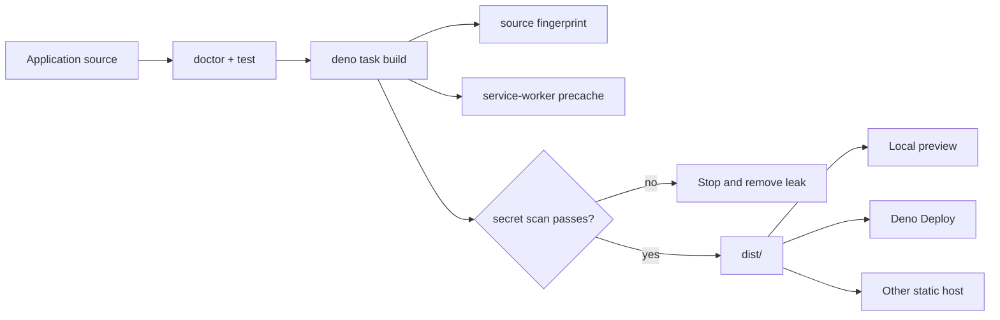

# Building and deploying a lofi app

lofi produces a static PWA. The production build contains prerendered HTML, JavaScript, the Jazz
WASM/runtime assets, the web manifest, and a revisioned service worker.



## Build and preview

```sh
deno task build
deno task preview
```

`build` writes `dist/`, records a source fingerprint in `dist/lofi-build.json`, generates the
precache list, and scans for server-secret values. Before Astro starts, the shared doctor preflight
validates the author-owned manifest and referenced assets. After Astro finishes, build verifies the
emitted HTML links, manifest, icons, nested routes, worker revision/scope, build identity, and exact
precache set together. `preview` refuses to start when the build identity is missing or invalid.

To use another preview port:

```sh
deno task preview --port 4173
```

## Configure the public application surface

Before deploying, review:

- `src/app.ts` — name, database namespace, stable credential origins, and repository URL;
- `public/manifest.webmanifest` — stable install identity, locale, icons, colors, launch behavior,
  and shortcuts;
- `public/favicon.svg` and any added icon files;
- page titles, descriptions, and starter copy;
- `.env` — either no public Jazz pair for local-only mode or a complete pair for optional sync.

The default deployment base is `/`. When a static host mounts the application below the origin root,
set the path once in `.env` before running `dev` or `build`:

```dotenv
LOFI_BASE_PATH=/field-notes/
```

The value must be an absolute path, not an origin. Lofi feeds it into Astro's `base` setting and
uses the resulting base for public asset links, the manifest, the service worker, its scope, build
identity, and local preview. Upload the contents of `dist/` to that same mount point. A root build
and a subpath build are different deployment artifacts; rebuild after changing `LOFI_BASE_PATH`.

Run `deno task doctor` and `deno task test` before the production build.

### Customize the web manifest before launch

Treat `public/manifest.webmanifest` as product source, not generated build metadata. Before users
install the app:

- replace `name`, `short_name`, `description`, `id`, `lang`, and `dir` with product values;
- choose an `id` URL token that will remain stable for the lifetime of the installed app; unlike
  `start_url`, it identifies the app and does not need to be a navigable page;
- keep `scope`, `start_url`, every shortcut URL, and every shortcut icon aligned with the deployed
  base path;
- replace the regular, maskable, Apple touch, and transparent monochrome icon assets while keeping
  their purposes intact;
- keep `orientation: "any"` unless the product genuinely needs a screen-orientation lock; and
- replace or remove the starter `Open tasks` shortcut when replacing the task example.

After launch, changing the name or start page is routine; changing `id` can make a browser treat the
manifest as a different installed application. Choose it once. If the product ships in multiple
languages, keep the default strings plus `lang` and `dir`, then add language maps such as
`name_localized`, `short_name_localized`, and `description_localized`. Localized values whose text
direction differs from the manifest default should declare their own `dir`.

Storefront metadata is optional and product-specific. Add lowercase `categories` only when they
truthfully describe the finished app. Add `iarc_rating_id` only after obtaining a real IARC
certification code; never copy a placeholder rating. Experimental capabilities such as file,
protocol, share-target, and launch handlers are deliberately absent from the starter and should be
added only with matching product behavior and tests. Use the
[installed-app recipe catalog](recipes/README.md) for the supported opt-in patterns.

### Replace or remove install presentation

The starter manifest includes one labeled `540x720` narrow screenshot, one labeled `1280x720` wide
screenshot, and one **Open tasks** shortcut. They are examples of the real generated app, not
generic promotional art. Before launch:

- replace both screenshots with current product captures and update each `sizes`, `label`, and
  `form_factor`, or remove the entire `screenshots` member and both files;
- replace the shortcut name, description, route, and icon with one useful product entry point, or
  remove the entire `shortcuts` member;
- keep shortcut routes inside manifest scope and backed by a prerendered route so they cold-start
  offline; and
- keep shortcut icons inside scope with truthful MIME types and dimensions.

Build validation checks every referenced asset, requires labeled narrow and wide variants when the
`screenshots` member is present, and rejects shortcut routes that were not emitted. Screenshots are
deliberately excluded from the required shell precache; deleting promotional captures cannot break
offline startup.

The starter does not claim a Web Share Target. If a product opts in, follow the tested
[Web Share recipe](recipes/web-share.md): first add a same-scope, prerendered action route, then add
a manifest member such as:

```json
{
  "share_target": {
    "action": "./share/",
    "method": "GET",
    "enctype": "application/x-www-form-urlencoded",
    "params": { "title": "title", "text": "text", "url": "url" }
  }
}
```

Use `parseTextShareTarget()` in the receiving island to ignore unknown parameters, reject duplicate
or oversized values, and accept a shared URL only after parsing it and allow-listing `https:` and
`http:`. Present the result as a draft: receiving a share is not user confirmation to persist it.
Build validation rejects malformed declarations, POST/file shares without a matching worker recipe,
and action routes that were not emitted for offline startup.

## Deno Deploy

Create the static application once:

```sh
deno task deploy:create --org <org> --app <app>
```

For later releases:

```sh
deno task deploy
```

Both tasks build first and deploy `dist/` as the static root.

## Other static hosts

Upload the contents of `dist/` to any host that can:

- serve `index.html` at the application root;
- preserve the manifest and WASM content types;
- serve the application over HTTPS;
- keep the service worker at the intended scope;
- fall back to the appropriate prerendered HTML for application routes.

Every prerendered route is included in the shell precache. While offline, a direct navigation such
as `/field-notes/settings/` resolves its cached `settings/index.html`; if that route was not
emitted, the worker falls back to the cached application root.

### Offline cache policy

The build's precache manifest contains required shell resources only. If any listed response cannot
be fetched, service-worker installation fails and reports a precache error rather than exposing a
worker that cannot cold-start the application. Product-specific optional resources do not belong in
that manifest.

Runtime caching is a separate, best-effort policy. It accepts only successful, public, same-origin
responses inside the worker scope for fonts, images, scripts, styles, and workers. Navigation,
cross-origin requests, partial responses, `private` or `no-store` responses, and `Vary: *` responses
are not added. The cache retains at most 64 entries, moves refreshed URLs to the end, evicts the
oldest inserted overflow, and removes previous build revisions during activation.

Navigation preload remains disabled: generated routes and their assets are precached, so starting a
parallel network request before the normal cache-first lookup would spend bandwidth on the expected
offline-ready path. Jazz sync, OPFS storage, background sync, and push remain outside the worker.

### Install and update lifecycle

The optional `PwaActions` UI uses a browser prompt only while `beforeinstallprompt` is actually
available. iOS receives its Share-menu steps. Other secure browsers with service-worker support get
generic browser-menu guidance that says to use **Install app** or **Add to Home Screen** only if the
browser offers it; an insecure or unsupported context is reported separately.

When the app returns to the foreground, restores from the back-forward cache, or reconnects, Lofi
asks the active service-worker registration to check for an update. Checks share one in-flight
request, time out, and are rate-limited. Update state moves through `checking`, `installing`,
`ready`, and `applying`; a waiting worker activates only after the user chooses **Update app**. Only
that explicit action permits the following controller change to reload the page, so ordinary worker
changes cannot create a reload loop.

A runtime-cache write error is best-effort and leaves the active worker ready. Registration,
required precache, and activation failures remain worker failures; update-check failures leave the
current worker running and retry on a later foreground signal.

Do not run a server-side Jazz credential in the static host or expose `JAZZ_ADMIN_SECRET` or
`BACKEND_SECRET` as public environment variables.

## Stable origins matter

Durable storage and service workers require a secure context outside localhost. WebAuthn credentials
also bind to the hostname. Choose the permanent production hostname before relying on device
credentials, add it to `credentialOrigins`, and avoid redirect or preview URLs that change between
deployments.

## Release verification

On the deployed HTTPS URL:

1. Confirm the device capability panel passes.
2. Add data, reload, and restart the browser.
3. Install the PWA and perform an offline cold start.
4. If sync is configured, opt in with a throwaway account and verify another device can recover it.
5. Inspect the built application for the expected version/source fingerprint.
