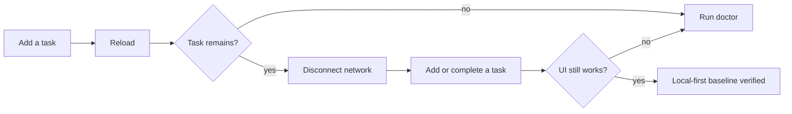
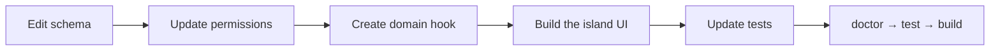

# Getting started with a generated lofi app

This guide begins after installing [Deno 2.9 or newer](https://docs.deno.com/runtime/).

## Create and run the app

```sh
deno run -A jsr:@nzip/lofi/create my-app
cd my-app
deno task dev
```

Open the URL printed by Astro. The starter contains a task list, an account panel when sync is
available, and device/runtime diagnostics.

Verify the local-first baseline before changing anything:



The default app is local-only. It does not require an `.env`, an account ceremony, or a backend.

## Run the project checks

```sh
deno task doctor
deno task test
deno task build
deno task preview
```

`doctor` checks the project layout and configuration without printing values. `test` runs the fast,
deterministic suite. `build` creates the production PWA in `dist/`, and `preview` serves that exact
output at `http://127.0.0.1:4321/` by default.

## Know which files to change

| File or directory    | Purpose                                                     |
| -------------------- | ----------------------------------------------------------- |
| `src/schema.ts`      | Tables and typed fields                                     |
| `src/permissions.ts` | Read and mutation policies                                  |
| `src/app.ts`         | App name, database name, stable origins, and repository URL |
| `src/pages/`         | Astro pages and shell composition                           |
| `src/islands/`       | Preact hooks and interactive UI                             |
| `src/styles/`        | Application styling                                         |
| `public/`            | Manifest, icon, and service-worker assets                   |
| `tests/`             | Application and local-first browser tests                   |
| `src/_lofi/`         | Generated framework runtime; do not edit                    |

Application hooks can import runtime seams from `src/_lofi/`, as the generated `use-tasks.ts` does.
The boundary means you should not modify the runtime implementation or import Jazz networking and
storage machinery directly into product components.

## Customize the application identity first

Before accumulating local data, update `src/app.ts`:

- `name` is the human-facing application name.
- `databaseName` namespaces durable browser storage.
- `repositoryUrl` controls the starter footer link.
- `credentialOrigins` lists hostnames you intend to keep stable if you use device credentials.

Also update `public/manifest.webmanifest`, `public/favicon.svg`, the page title, and starter copy.

Changing `databaseName` later points the browser at a different local database. Choose it early so a
cosmetic rename does not make existing device data appear to disappear.

## Replace the task example

The fastest path is to change one layer at a time while keeping the app runnable:



Continue with [Data and UI](data-and-ui.md) for the table-to-island pattern and
[Permissions](permissions.md) before exposing new data.

## Add sync only when you need it

Local-only development is the normal starting point. To add managed Jazz sync and account recovery:

```sh
deno task jazz:provision
```

Then follow [Sync and recovery](sync-and-recovery.md). Provisioning makes sync available; each user
still chooses whether their existing local account should begin syncing.
