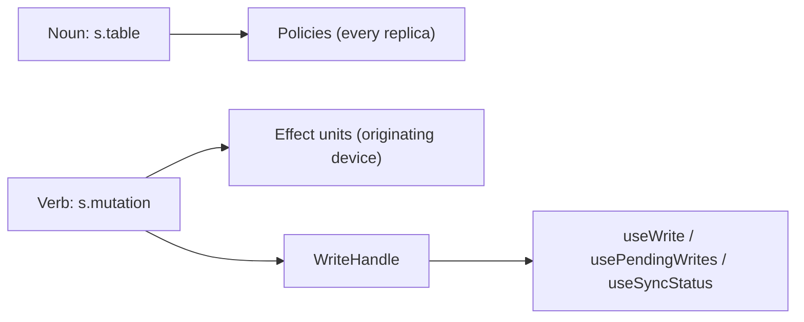

# Nouns and verbs

A lofi application has two kinds of declarations. Tables are the nouns: they say what exists.
Policies attach to tables because a policy must be safe to evaluate on every replica that holds the
data. Mutations are the verbs: they say what happens. Consequences attach to verbs because a
consequence needs an owner — the one device that performed the intent. The API keeps the name
`s.table`; this grammar is how to think about where things belong, not a set of identifiers.

The one-sentence contract: **an effect runs after the write syncs, even if the app restarts in
between; if the write is rejected, `onRejected` runs instead.**



## The write lifecycle

Every write moves through a closed, framework-owned lifecycle. Stages are monotonic — a write never
moves backwards:

| stage      | meaning                                                                           |
| ---------- | --------------------------------------------------------------------------------- |
| `saving`   | accepted by the runtime, not yet durable                                          |
| `saved`    | durable on this device; `await write` resolves here                               |
| `syncing`  | in transit to the store (appears only when the runtime can observe the transport) |
| `synced`   | the store confirmed the write                                                     |
| `rejected` | the store adjudicated the write and denied it                                     |

`await write` resolves at `saved` — the same local-durability contract every mutation in lofi keeps.
The UI clears the form and moves on. Sync is a property you reach for, not what `await` gives you:

```ts
const write = placeOrder({ item, qty }); // WriteHandle<Order>
const order = await write; // saved: durable on this device
await write.synced; // confirmed by the store
write.stage; // current stage, always readable
write.reason; // { code, reason } when rejected
```

The current runtime moves writes from `saved` directly to `synced`; the `syncing` stage and an
offline reason appear once the runtime can observe its connection. On a device with no sync location
at all there is no store to adjudicate, so local durability is settlement: the write reads `synced`
and effects run once it is durable on the device.

## Declaring verbs

A verb is a named mutation over one table operation, declared once with `s.mutation`. Call sites
invoke it like a function and carry nothing:

```ts
import { s } from "@nzip/lofi/schema";
import { app } from "../app.ts";

const chargeCard = s.effect("chargeCard", app.schema.orders, {
  onSynced: async (order, { journalId }) => {
    // The world accepted the order. Pass journalId to external APIs
    // as the idempotency key.
  },
  onRejected: async (order) => {
    // The order never happened: compensate what the user saw.
  },
});

export const placeOrder = s.mutation("placeOrder", s.insert(app.schema.orders), {
  effects: [chargeCard, s.log("order-placed")],
});
```

`s.insert(table)`, `s.update(table)`, and `s.remove(table)` declare which operation the verb
performs; the verb's call signature follows from it. Inline `onSynced`/`onRejected` options are
sugar for an implicit single unit named after the verb.

Naming: tables are plural nouns (`orders`, `tasks`), verbs are imperative verb phrases
(`placeOrder`, not `orderInsert`). Verb and effect names are durable identities — the journal uses
them to re-arm handlers after a reload — and must be unique per app; duplicate declarations fail
fast.

## Effect units

An effect unit is a named, reusable pairing of action and compensation. Effects live on verbs: never
per call (forgettable, inconsistent across call sites) and never per table (tables carry no intent,
and data-attached effects would have no owning replica).

- Handlers run on the originating device only. The journal is local to the device that performed the
  intent; other replicas sync the data and run nothing.
- Units are independent. Each is journaled and retried on its own; one unit's failure never blocks
  another, and there are no ordering guarantees between units of one write. Anything order-dependent
  composes by a unit issuing a further write.
- There is no `onSaved`. Ordinary code after `await write` covers that moment.
- Delivery is at-least-once. A crash between handler start and journal completion re-runs the
  handler at the next boot. Handlers that call external services must be idempotent: pass the
  `journalId` the handler receives — the write's `(write id, effect name)` key — as the idempotency
  key to payment-style APIs.
- A failed handler is surfaced in runtime diagnostics and re-armed at the next boot, never silently
  swallowed.

`s.log(label)` is a built-in unit that records a structured entry in runtime diagnostics on either
fate. Repeated calls with one label share one unit. It is the first of a tiered built-in library —
observe (`s.log`, `s.trace`), make fate data (`s.notice`, `s.mark`), compose (`s.chain`), reach the
outside world (`s.webhook`) — with the contract for authoring your own. See
[the effect library](effects.md).

## Retention: durable things know how to die

Obligations, intents, and residue each have a lifespan and a defined afterlife.

- **Obligations** — `s.effect(name, table, handlers, { expiresAfterMs })` declares a delivery window
  in milliseconds, measured from the write. When the write synced but the obligation could not be
  delivered inside the window (device offline, handler failing), the obligation retires as expired:
  no handler fires — the write happened, so compensation would be wrong — diagnostics count it, and
  the entry becomes prunable. External-tier handlers whose receivers keep finite idempotency windows
  should always set this.
- **Intents** — `s.mutation(name, op, { expiresAfterMs })` declares the intent's lifespan. A write
  still pending past it is surfaced: the pending-writes set marks it `expired` and diagnostics count
  it. The runtime cannot withdraw a locally accepted write — the engine re-proposes pending batches
  until the store answers, and a rolled-back batch primitive exists only for uncommitted batches —
  so an overdue intent is reported, never retired: retiring it as rejected could fire compensation
  for a write that later syncs anyway. When store-side expiry enforcement lands, an overdue intent
  will settle as `rejected` with cause `expired`; the cause type already carries that value so the
  surface is forward-compatible.
- **Residue** — a handler that keeps failing is quarantined after a bounded number of attempts
  (`maxAttempts`, default 5): the obligation retires as failed-permanent, diagnostics count it, and
  the entry becomes prunable instead of re-arming forever.

The two expirations are distinct on purpose: an expired _intent_ is a write that never happened
(compensation would apply, once it can be sound); an expired _obligation_ is a write that happened
whose side effect missed its window (compensation would be wrong).

### What the journal stores

The journal persists write identity, fate, and per-column keyed hashes (HMAC-SHA-256 under a random
per-journal key) — enough for the boot equality probe, never the column values themselves. This
prevents a second greppable plaintext copy of row data beside the store. It does not protect
low-entropy values against brute force by an attacker holding the whole storage; that attacker's
access already equals the local store's own at-rest posture.

## Rejection is a verdict, not an error

Two very different things can say no:

- **Local refusal.** The runtime refuses a write that violates the policy this device currently
  holds. The refusal throws synchronously from the verb call — ordinary error handling — and never
  creates a stage, a journal entry, or an effect. Nothing was shown to the user, so there is nothing
  to compensate.
- **Adjudicated rejection.** A write accepted locally under a policy that had already tightened at
  the store is denied when it arrives. The write settles as `rejected`, `write.synced` rejects, and
  `onRejected` runs — once — on the originating device. Compensation gates on the store's permanent
  verdicts only; an unknown or transient code keeps the write pending.

The engine rolls a rejected write back out of local query results itself: the optimistic row
disappears, a rejected patch reverts. `onRejected` therefore compensates what the user was told —
notices, external calls, follow-up writes — not the row data.

## Pending state in the UI

The journal persists every unsettled write beside the runtime's storage, readable at boot before
sync connects, so pending state survives a reload:

```tsx
import { usePendingWrites, useSyncStatus, useWrite } from "@nzip/lofi/preact";

const pending = usePendingWrites(); // { count, writes } — "N changes waiting to sync"
const status = useSyncStatus(task); // "synced" | "waiting" | "rejected" per row
const { stage, reason } = useWrite(write); // one write's live stage
```

All three surfaces are level-triggered: they report current truth rather than events, so a component
that mounts late sees the same state as one that watched every transition.

## API reference

- `WriteHandle<T>` — thenable per-write handle: `saved`, `synced`, `stage`, `reason`, `subscribe`.
  Returned by verbs and by `useTableMutations` methods.
- `s.mutation(name, op, options?)` — declares a typed callable verb; `options.effects` attaches
  units, inline `onSynced`/`onRejected` declare an implicit unit.
- `s.effect(name, table, handlers)` — declares a named, reusable, typed effect unit.
- `s.log(label)` — built-in unit recording a diagnostics entry.
- `useWrite(write)` — `{ stage, reason }` with re-render on change.
- `usePendingWrites()` — the reload-safe pending set.
- `useSyncStatus(row)` — per-row badge state.

Generated API pages for these exports live in the [API reference](/api).

## See also

- [Data and UI](data-and-ui.md) — tables, queries, and the domain-hook pattern.
- [Permissions](permissions.md) — the policies that attach to nouns.
- [Sync and recovery](sync-and-recovery.md) — how a device elects sync and recovers an account.
