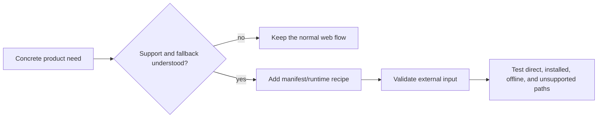

# Optional installed-app recipes

These recipes add OS-facing PWA capabilities only when a product has a concrete use case. They are
not part of the generated starter and unsupported browsers keep the normal web experience.

## Available

- [Inbound and outbound Web Share](web-share.md) — share text or links through the OS sheet and
  receive an untrusted draft through an optional installed-app share target.
- [Launch handling and client reuse](launch-handler.md) — safely focus or navigate an existing
  installed window while preserving ordinary launch behavior elsewhere.
- [File handling and import previews](file-handler.md) — validate explicitly associated files into
  transient drafts before the user confirms persistence.
- [Custom-protocol item links](protocol-handler.md) — parse one product-owned `web+` scheme into
  allow-listed collaborative-list identifiers without arbitrary redirects.

## Contract for every recipe

- Keep the capability absent until the application opts in.
- State the product use case and current browser/OS support.
- Feature-detect and preserve a useful ordinary-web fallback.
- Ask for permission only after a user action that explains the value.
- Treat launch payloads, files, URLs, messages, and subscription data as untrusted input.
- Explain whether an install, reinstall, manifest refresh, or worker update is required.
- Test direct browser navigation, installed launch, offline startup, unsupported browsers, malformed
  input, and removal of the capability.

Foreground recovery remains lofi's portable baseline. A recipe never moves Jazz sync or OPFS into
the service worker without a separate architecture decision.
