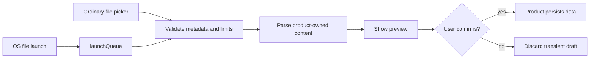

# File handling and import previews

Use this recipe when an installed desktop app should open a narrow, product-owned export format. The
normal `<input type="file">` import remains the portable fallback.
[Installed PWA file handling](https://developer.mozilla.org/en-US/docs/Web/Progressive_web_apps/How_to/Associate_files_with_your_PWA)
is experimental and currently limited to Chromium-based browsers on desktop operating systems.

The recipe deliberately ends at an import draft:



## 1. Add a narrow manifest association

The generated starter has no `file_handlers` member. Add one only for a concrete import format:

```json
{
  "file_handlers": [
    {
      "action": "./import/",
      "accept": {
        "application/json": [".field-notes.json"]
      }
    }
  ]
}
```

Use exact MIME types and extensions—no wildcards. The action must be a prerendered route inside the
manifest scope so the import screen can open offline. Browsers read this association during install;
after changing it, refresh or reinstall the PWA and verify the operating-system association.

## 2. Use one validator for launches and the picker

```ts
import {
  type FileImportDraft,
  installFileLaunchConsumer,
  prepareFileImportDrafts,
} from "@nzip/lofi/recipes/file-handler";

type ExportPreview = { title: string; rows: readonly unknown[] };

const importOptions = {
  accept: { "application/json": [".field-notes.json"] },
  maxFiles: 1,
  maxFileBytes: 256_000,
  async parse(file: File): Promise<ExportPreview> {
    const value: unknown = JSON.parse(await file.text());
    if (!isFieldNotesExport(value)) throw new Error("invalid export");
    return value;
  },
};

let preview: readonly FileImportDraft<ExportPreview>[] = [];

const launched = installFileLaunchConsumer({
  ...importOptions,
  onDrafts: (drafts) => {
    preview = drafts;
    renderImportPreview(drafts);
  },
  onRejected: () => renderGenericImportError(),
});

async function onPickerChange(files: FileList | null) {
  const result = await prepareFileImportDrafts(files ? [...files] : [], importOptions);
  if (result.ok) renderImportPreview(result.drafts);
  else renderGenericImportError();
}
```

Register one `launchQueue` consumer early on the action route. The recipe's shared ownership seam
prevents an older development/HMR consumer from replacing a newer launch recipe. Do not register a
second raw queue consumer in the same window.

The helper treats handles, names, MIME types, extensions, sizes, access errors, and parsed content
as untrusted. Rejections expose stable reason codes and an index, never file names or contents. A
denied handle becomes `unreadable-file`; invalid and oversized inputs never produce a partial draft.

## 3. Confirm before persistence

Keep returned drafts in transient component state. Render a preview and use a separate button such
as “Import these notes” for the application-owned database write. Neither `prepareFileImportDrafts`
nor `installFileLaunchConsumer` writes to Jazz, OPFS, the service worker, or the source file.

Test direct navigation to the action route, an installed file launch, an ordinary picker import,
offline startup, denied access, malformed content, invalid metadata, oversized files, cancellation,
and a browser without `launchQueue`. Removing `file_handlers` should leave the picker flow intact;
reinstall or refresh the app before verifying that the OS association disappeared.
