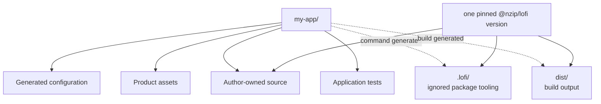

# Generated project layout

The generated project is deliberately small: application source and branding are yours, while the
pinned `@nzip/lofi` package supplies runtime, PWA, identity, sync, diagnostics, and Astro/Vite
integration. Package commands regenerate framework tooling and production output without copying
framework source into the application.

## Exact source-controlled file map

The following keys are extracted by the documentation drift test and compared with a real generated
project. Adding or removing a generated file requires updating this map in the same change.

<!-- generated-file-map:start -->

| Path                             | Ownership category      | Role                                                                                   |
| -------------------------------- | ----------------------- | -------------------------------------------------------------------------------------- |
| `.env.example`                   | Generated configuration | Names optional public sync settings and server-only secrets without values.            |
| `.gitignore`                     | Generated configuration | Keeps secrets, dependencies, package tooling, builds, and failure artifacts untracked. |
| `README.md`                      | Generated configuration | Gives the generated app's first commands, package boundary, and hosting path.          |
| `deno.json`                      | Generated configuration | Pins one lofi package version and exposes the supported task surface.                  |
| `public/apple-touch-icon.png`    | Product asset           | Supplies the replaceable 180x180 iOS Home Screen icon.                                 |
| `public/favicon.svg`             | Product asset           | Supplies the replaceable vector browser icon and source mark.                          |
| `public/icon-192.png`            | Product asset           | Supplies the regular 192x192 install icon.                                             |
| `public/icon-512.png`            | Product asset           | Supplies the regular 512x512 install icon.                                             |
| `public/icon-maskable-512.png`   | Product asset           | Supplies a padded 512x512 maskable icon with a safe-zone-aware mark.                   |
| `public/manifest.webmanifest`    | Product asset           | Declares install metadata, theme colors, scope, and raster icons.                      |
| `src/app.ts`                     | Author-owned source     | Composes the app name, storage, sync, credential origins, and repository link.         |
| `src/env.d.ts`                   | Generated configuration | Adds Astro and lofi build-time environment types.                                      |
| `src/islands/AccountGate.tsx`    | Author-owned source     | Presents opt-in account backup, sync, and recovery controls.                           |
| `src/islands/TaskList.tsx`       | Author-owned source     | Implements the replaceable starter task experience.                                    |
| `src/islands/use-tasks.ts`       | Author-owned source     | Binds the starter task table to Preact through public package APIs.                    |
| `src/layouts/Shell.astro`        | Author-owned source     | Owns document metadata, install links, and package boot.                               |
| `src/pages/index.astro`          | Author-owned source     | Composes the starter page and package-owned optional UI.                               |
| `src/permissions.ts`             | Author-owned source     | Declares application read and mutation policy.                                         |
| `src/schema.ts`                  | Author-owned source     | Declares persisted application tables and fields.                                      |
| `src/styles/global.css`          | Author-owned source     | Styles the starter page, islands, and optional package surfaces.                       |
| `tests/auth_e2e_test.ts`         | Application test        | Demonstrates an opt-in browser credential round trip.                                  |
| `tests/author-boundary_test.ts`  | Application test        | Prevents framework plumbing from returning to author UI.                               |
| `tests/convergence_e2e_test.ts`  | Application test        | Demonstrates the optional two-client synced browser journey.                           |
| `tests/testing-contract_test.ts` | Application test        | Type-checks the public local-first browser helpers.                                    |
| `tsconfig.json`                  | Generated configuration | Enables strict Astro and Preact source checking.                                       |

<!-- generated-file-map:end -->

## Regenerated and ignored output

These paths are not source-controlled generated files. Package commands recreate them as needed.

| Path     | Ownership category      | Role                                                                                                                   |
| -------- | ----------------------- | ---------------------------------------------------------------------------------------------------------------------- |
| `.lofi/` | Ignored package tooling | Materialized package runtime plus Astro/Vite/Jazz configuration used by `dev` and `build`.                             |
| `dist/`  | Build output            | Static production shell, hashed assets, install icons, build identity, precache manifest, and package-emitted `sw.js`. |

Generated applications do not contain `src/_lofi/`, a source `public/sw.js`, or a checked-in
`astro.config.ts`. Upgrade the single pinned `@nzip/lofi` version to change framework behavior; edit
the author-owned source and product assets to change the application.
