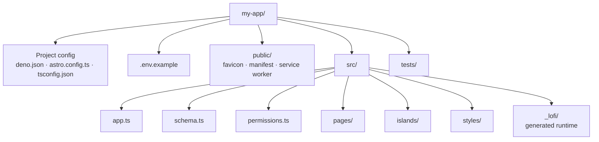

# Generated project layout

## Author-owned files

- `src/schema.ts` declares persisted tables and their field types.
- `src/permissions.ts` declares read and mutation policies.
- `src/app.ts` composes product configuration.
- `src/pages/`, `src/islands/`, and `src/styles/` contain the product experience.
- `public/` contains install and static shell assets.
- `tests/` contains application tests and worked local-first browser examples.

## Generated runtime files

`src/_lofi/` owns durable storage, the Jazz client, account sessions, recovery, lifecycle handling,
PWA capability gates, diagnostics, and table stores. Do not edit these files during normal product
work.

The generated domain hook imports selected `_lofi` runtime seams. Follow that pattern when binding a
new table, but keep vendor setup, storage selection, transports, service-worker logic, and
capability branching out of product components.
