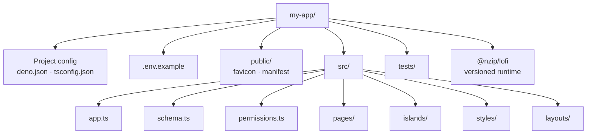

# Generated project layout

## Author-owned files

- `src/schema.ts` declares persisted tables and their field types.
- `src/permissions.ts` declares read and mutation policies.
- `src/app.ts` composes product configuration.
- `src/pages/`, `src/islands/`, and `src/styles/` contain the product experience.
- `public/` contains install and static shell assets.
- `tests/` contains application tests and worked local-first browser examples.

## Versioned framework runtime

`@nzip/lofi` owns durable storage, the Jazz client, account sessions, recovery, lifecycle handling,
PWA capability gates, diagnostics, and table stores. These modules are installed once through the
pinned package version instead of copied into application source.

The generated domain hook imports selected public package seams. Follow that pattern when binding a
new table, but keep vendor setup, storage selection, transports, service-worker logic, and
capability branching out of product components. `deno task dev` and `build` materialize ignored
Astro integration files under `.lofi/`; `build` emits the service worker into `dist/`.
