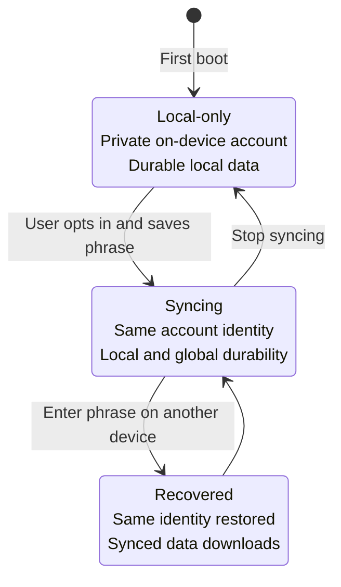

# Sync and recovery

Sync is optional infrastructure layered onto an account that already works locally. Configuring a
Jazz app makes sync available; it does not automatically upload every user's local data. Each user
elects to back up and sync from the generated `AccountGate` UI.

## Provision a managed Jazz app

From an existing generated project:

```sh
deno task jazz:provision
```

Or provision during project creation:

```sh
deno run -A jsr:@nzip/lofi/create --sync my-app
```

Provisioning writes four names to the git-ignored `.env`:

| Name                | Exposure       | Purpose                                 |
| ------------------- | -------------- | --------------------------------------- |
| `JAZZ_APP_ID`       | Client-visible | Identifies the managed Jazz application |
| `JAZZ_SERVER_URL`   | Client-visible | Selects the managed sync endpoint       |
| `JAZZ_ADMIN_SECRET` | Server-only    | Authorizes schema/permission operations |
| `BACKEND_SECRET`    | Server-only    | Reserved server-side credential         |

Claim the generated Jazz application within the window printed by the command. Keep `.env` private;
the build projects only the complete public pair and scans the client output for secret values.

Run `deno task doctor` after provisioning. A partial public pair is invalid: set both public names
or remove both to return to local-only mode.

## The user's account journey



Data created before opt-in carries forward because enabling sync does not replace the account
secret.

## Recovery guarantees and limits

- The recovery phrase is the account authority. Anyone with all the words can act as that account.
- lofi does not retain material that can reconstruct the account for the user.
- Losing both the device and every copy of the phrase loses the account.
- Recovering a phrase can retrieve data that was synced. It cannot reconstruct writes that existed
  only in storage on a lost device.
- Restoring replaces the current device account, so the generated UI confirms before abandoning an
  unsynced local identity.

Read [Identity and recovery model](auth-identity.md) for the detailed state machine and custody
model.

## Before shipping sync

- Customize the account copy without weakening the recovery warnings.
- Confirm the production build receives the intended public configuration.
- Run `deno task build` and verify the secret scan passes.
- Test recovery using throwaway data and a second browser profile or device.
- Run the two-client convergence example described in [Testing](testing.md).
- Decide how users will store their phrase safely; there is no server-assisted reset flow.
