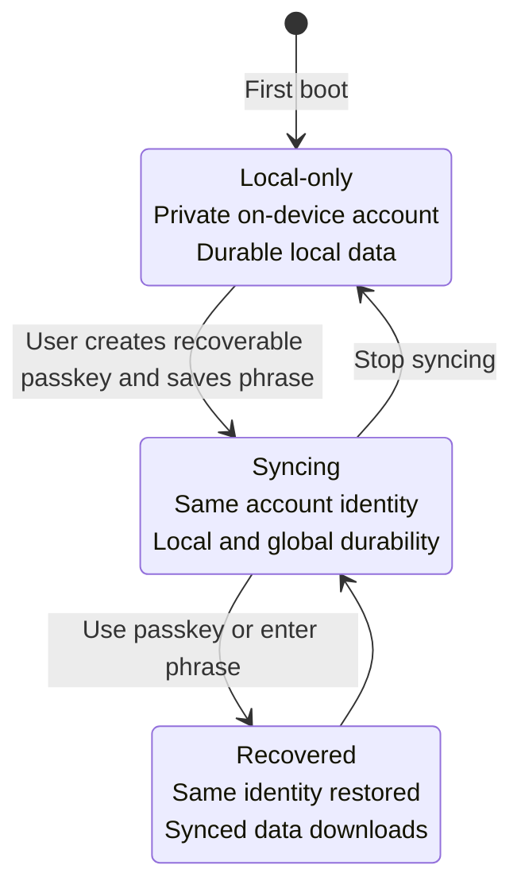

# Sync and recovery

Sync is optional infrastructure layered onto an account that already works locally. A sync location
makes sync available; it does not automatically upload every user's local data. Each user elects to
back up and sync from the generated `AccountGate` UI.

There are two ways a device gets a sync location: the deployment can compile one in (a managed Jazz
app — the _default sink_), or the user can declare one at runtime by enrolling a ticket from a
self-hosted node. Both feed the same election flow. Running that node yourself — one binary,
tickets, optional node-to-node replication — is covered in the [self-hosting section](/node).

## Provision a managed Jazz app

From an existing generated project:

```sh
deno task jazz:provision
```

Or provision during project creation:

```sh
deno run -A jsr:@nzip/lofi/create --sync my-app
```

Provisioning writes four names to the git-ignored `.env`:

| Name                | Exposure       | Purpose                                 |
| ------------------- | -------------- | --------------------------------------- |
| `JAZZ_APP_ID`       | Client-visible | Identifies the managed Jazz application |
| `JAZZ_SERVER_URL`   | Client-visible | Selects the managed sync endpoint       |
| `JAZZ_ADMIN_SECRET` | Server-only    | Authorizes schema/permission operations |
| `BACKEND_SECRET`    | Server-only    | Reserved server-side credential         |

Claim the generated Jazz application within the window printed by the command. Keep `.env` private;
the build projects only the complete public pair and scans the client output for secret values.

Run `deno task doctor` after provisioning. A partial public pair is invalid: set both public names
or remove both to return to local-only mode.

## Bring your own sync location

The sync destination can be **user-selected data instead of developer configuration**. A self-hosted
node (such as [lofi-node](https://github.com/FelineStateMachine/lofi-node)) issues an app-connect
ticket — a `lofisync1.…` string carrying the store's app id and a gate URL — and the user pastes it
into the app:

```ts
import { enrollSyncTicket, isDataSinkError } from "@nzip/lofi";

try {
  const session = await enrollSyncTicket(pastedTicket);
  // session.sink → { source: "declared", host: "192.168.1.10:4802", label: "phone" }
} catch (error) {
  if (isDataSinkError(error)) showEnrollmentProblem(error.code, error.message);
  else throw error;
}
```

Enrollment declares the ticket as this device's _data sink_ and elects sync in one step: the local
data pushes up under the same account identity, exactly as electing against a compiled managed app
does. `parseSyncTicket` validates a pasted string without enrolling it (returns `null` on any
malformed input), and `readDeclaredSink` / `clearDeclaredSink` manage the declaration directly. A
non-ticket location can be declared with `declareDataSink({ appId, serverUrl })`.

Semantics to rely on:

- **First boot is unchanged.** Without a compiled managed app or a declared sink the device is
  local-only, and nothing leaves it.
- **A declared sink overrides the compiled default** for this device. A deployment pinned to its own
  managed app refuses tickets for a different app id, so a hosted product cannot be silently
  re-pointed.
- **One store, one active sink.** Declaring a different sink over an existing one is refused; clear
  the declaration first. Local data and elections survive clearing.
- **The ticket URL is a bearer credential.** It is used verbatim as the sync server (its secret path
  is what authorizes transport), stored in a device-local record, and never exposed through the
  session snapshot — `session.sink` carries only the source, host, and label.
- **Tickets carry a scope.** A plain (or `scope: "sync"`) ticket is transport only; a
  `scope: "provision"` ticket additionally administers the store through the node's gate — the basis
  for opt-in store provisioning. A ticket with an unrecognized scope is rejected outright rather
  than silently granted less than it claims.
- If the node revokes the ticket, requests fail with 401 and live sockets close; treat the stored
  sink as dead and surface re-enrollment rather than retrying silently.

## The user's account journey



Data created before opt-in carries forward because enabling sync does not replace the account
secret.

## Recovery guarantees and limits

- The recoverable passkey stores the same account secret inside a resident, user-verifying
  credential. Restoring it replaces the Jazz client and confirms the same `session.user_id`.
- Passkey availability is provider- and RP-ID-dependent. Pin `passkey.rpId` to the canonical
  production hostname. A passkey created for a preview hostname cannot move to another RP-ID.
- iCloud Keychain, Google Password Manager, and third-party managers have different platform
  boundaries. lofi does not promise universal iOS/Android/browser/provider portability.
- The recovery phrase is the account authority. Anyone with all the words can act as that account.
- lofi does not retain material that can reconstruct the account for the user.
- Losing both the device and every copy of the phrase loses the account.
- Recovering a phrase can retrieve data that was synced. It cannot reconstruct writes that existed
  only in storage on a lost device.
- Restoring replaces the current device account, so the generated UI confirms before abandoning an
  unsynced local identity.
- Older lofi guard-only credentials protect phrase reveal on one device; they do not contain the
  Jazz secret and are not recoverable account backups.

Read [Identity and recovery model](auth-identity.md) for the detailed state machine and custody
model.

## Before shipping sync

- Customize the account copy without weakening the recovery warnings.
- Confirm the production build receives the intended public configuration.
- Run `deno task build` and verify the secret scan passes.
- Test recovery using throwaway data and a second browser profile or device.
- Run the two-client convergence example described in [Testing](testing.md).
- Decide how users will store their phrase safely; there is no server-assisted reset flow.
