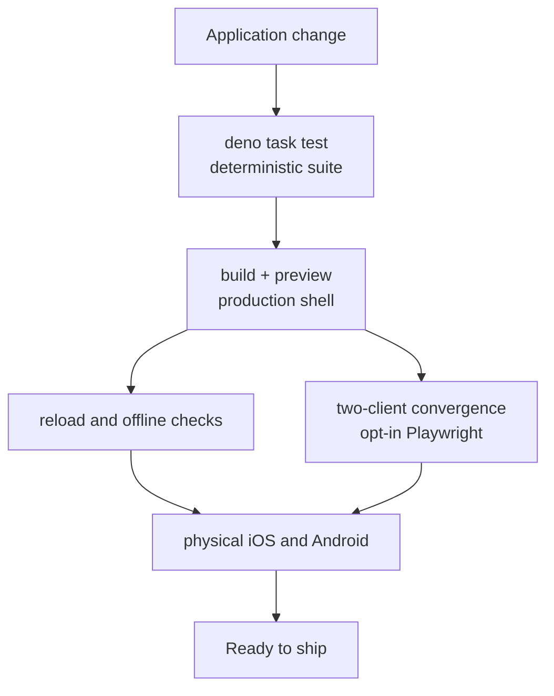
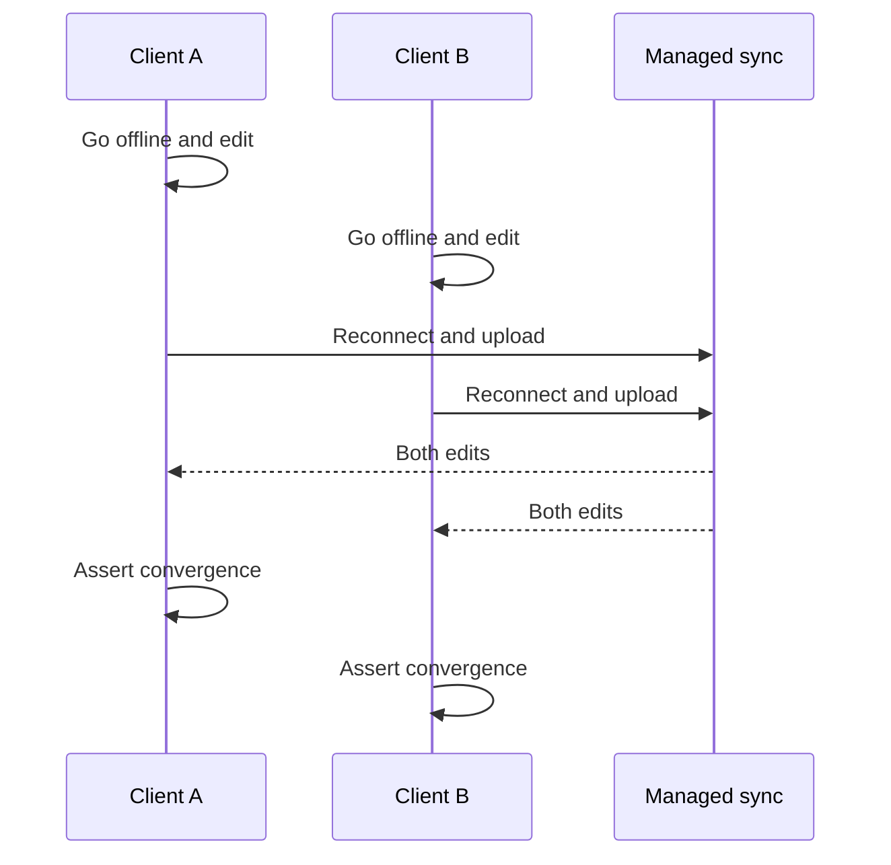

# Testing a lofi app

The generated template separates fast deterministic tests from opt-in browser scenarios that need a
running app, Chromium, and—for convergence—managed sync.



## Run the default suite

```sh
deno task test
```

The default suite covers application tests without launching a browser. Framework runtime contracts
run once in the `@nzip/lofi` package suite instead of being copied into every application. Keep
domain logic and permission-shape checks in this fast path when possible.

## Test the production build manually

```sh
deno task build
deno task preview
```

Then verify:

1. Add data and reload.
2. Confirm the status reports local durability.
3. Disable the network and continue reading and writing.
4. Reload while offline to exercise the production service worker.
5. Restore the network and confirm the local data remains.

The service worker is intentionally disabled during `deno task dev`; use a production build when
testing offline shell startup.

## Run the two-client convergence example

First configure managed sync and start the app:

```sh
deno task jazz:provision
deno task dev
```

In another terminal, point the included browser example at the printed URL:

```sh
LOFI_E2E_BASE_URL=http://127.0.0.1:4321/ \
  deno test -A tests/convergence_e2e_test.ts
```



Both browser contexts use one test identity. Without `LOFI_E2E_BASE_URL`, the example skips so the
default suite remains fast.

If Chromium is missing:

```sh
deno run -A npm:playwright@1.61.1 install chromium
```

## Adapt the example to your UI

Update these four pieces in `tests/convergence_e2e_test.ts`:

- `ready` — a DOM condition proving the local store has hydrated;
- `apply` — the user action that makes one local mutation;
- `locallyApplied` — proof that the offline client rendered its own mutation;
- `converged` — proof that both clients eventually render all expected results.

Use stable accessible roles, labels, and application-owned `data-*` attributes. Avoid arbitrary
sleeps; readiness helpers retry observable conditions until their timeout.

## Failure artifacts

Browser fixtures can save artifacts under `test-results/`. Snapshot callbacks should contain counts,
booleans, state names, or sanitized identifiers—not task text, environment values, recovery phrases,
or other user data.

## Physical-device checks

Browser automation does not prove installed-PWA storage and lifecycle behavior on iOS or Android.
Before shipping, use a stable HTTPS origin and exercise installation, termination, device restart,
offline cold start, foreground recovery, and account recovery on every supported mobile surface.
