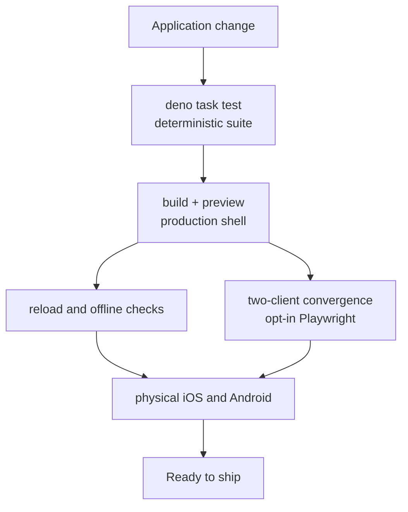
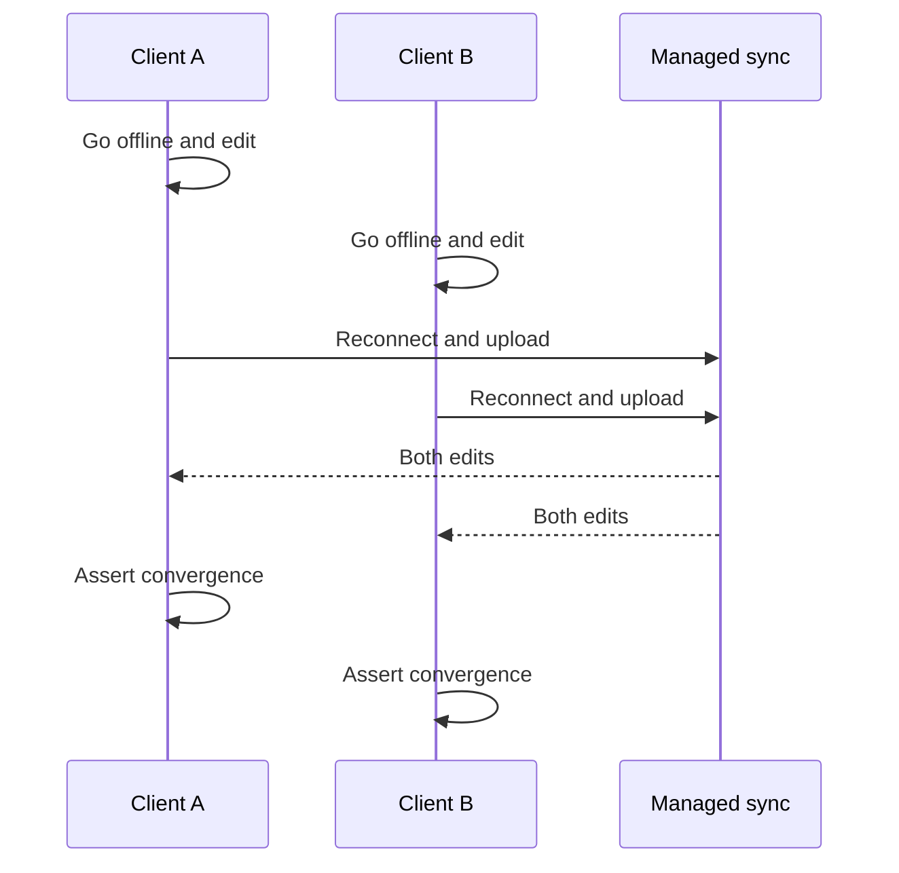

# Testing a lofi app

The generated template separates fast deterministic tests from opt-in browser scenarios that need a
running app, Chromium, and—for convergence—managed sync. Framework release checks also exercise
recoverable accounts and access policies; generated applications reuse those package-owned seams.



## Run the default suite

```sh
deno task test
```

The default suite covers application tests without launching a browser. Framework runtime contracts
run once in the `@nzip/lofi` package suite instead of being copied into every application. Keep
domain logic and permission-shape checks in this fast path when possible.

## Test the production build manually

```sh
deno task build
deno task preview
```

Then verify:

1. Add data and reload.
2. Confirm the status reports local durability.
3. Disable the network and continue reading and writing.
4. Reload while offline to exercise the production service worker.
5. Restore the network and confirm the local data remains.

The service worker is intentionally disabled during `deno task dev`; use a production build when
testing offline shell startup.

## Run the two-client convergence example

First configure managed sync and start the app:

```sh
deno task jazz:provision
deno task dev
```

In another terminal, point the included browser example at the printed URL:

```sh
LOFI_E2E_BASE_URL=http://127.0.0.1:4321/ \
  deno test -A tests/convergence_e2e_test.ts
```



Both browser contexts use one test identity. Without `LOFI_E2E_BASE_URL`, the example skips so the
default suite remains fast.

Two more opt-in browser gates ship with the starter:

- `tests/backup_migration_e2e_test.ts` — the account journey in one real browser: rows written
  local-only must survive electing backup and sync (the runtime copies them into the managed
  namespace during the reload, settling at local durability, so the sync server does not need to be
  reachable), and the phrase-reveal guard must accept only its enrolled passkey — after the
  authenticator loses its credentials, the reveal fails closed. Serve on `localhost` (a passkey
  RP-ID cannot bind to a bare IP).
- `tests/auth_e2e_test.ts` — the device-credential enroll → authenticate round-trip on a stable
  origin listed in `credentialOrigins`.

If Chromium is missing:

```sh
deno run -A npm:playwright@1.61.1 install chromium
```

## Adapt the example to your UI

Update these four pieces in `tests/convergence_e2e_test.ts`:

- `ready` — a DOM condition proving the local store has hydrated;
- `apply` — the user action that makes one local mutation;
- `locallyApplied` — proof that the offline client rendered its own mutation;
- `converged` — proof that both clients eventually render all expected results.

Use stable accessible roles, labels, and application-owned `data-*` attributes. Avoid arbitrary
sleeps; readiness helpers retry observable conditions until their timeout.

## Failure artifacts

Browser fixtures can save artifacts under `test-results/`. Snapshot callbacks should contain counts,
booleans, state names, or sanitized identifiers—not task text, environment values, recovery phrases,
or other user data.

## Framework recovery and permission evidence

The framework repository's `deno task check` includes the access-security suite. It uses Jazz's
permission-test app for owner, recipient, unrelated-user, revoke, fixed-role, membership, removal,
and self-leave rejection cases, plus a real local Jazz server for offline grant/revoke and
membership reconciliation.

`deno task test:golden` extends the existing generated-app runner with a two-profile journey. A
Chromium virtual authenticator creates and exports a resident credential, a fresh browser process
imports it, and the real WebAuthn assertion restores the same Jazz principal and synced rows. The
runner pins the exported credential as the assertion's allow-list because headless Chromium cannot
show its resident-credential account chooser. It also proves recovery-phrase fallback when the
credentials API is unavailable and proves that stopped sync retains the managed local replica
through a production offline reload.

This is automated virtual-authenticator evidence, not physical iOS or Android evidence. It does not
prove passkey-provider portability, mobile installed-PWA lifecycle behavior, or transport
convergence without the local Jazz server used by the journey.

## Physical-device checks

Browser automation does not prove installed-PWA storage and lifecycle behavior on iOS or Android.
Before shipping, use a stable HTTPS origin and exercise installation, termination, device restart,
offline cold start, foreground recovery, and account recovery on every supported mobile surface.

The WebAuthn PRF extension is the one credential path no virtual authenticator models, so PRF is
feature-detected in the runtime and must be validated on real hardware. The manual pass, per
supported platform/passkey-provider pair:

1. `getAuthCapability()` reports `prf: "available"` (or `"not-reported"` with a working derive).
2. Enroll a device credential on the pinned production RP-ID and derive a PRF secret twice with the
   same salt — both ceremonies must yield the same 32 bytes.
3. Encrypt with the derived at-rest key, restart the browser/app, derive again, and decrypt.
4. Confirm a different salt yields a different secret and cannot decrypt the first blob.
5. On providers that sync passkeys, repeat the derive on a second device of the same ecosystem and
   record whether PRF results roam — do not assume they do.
